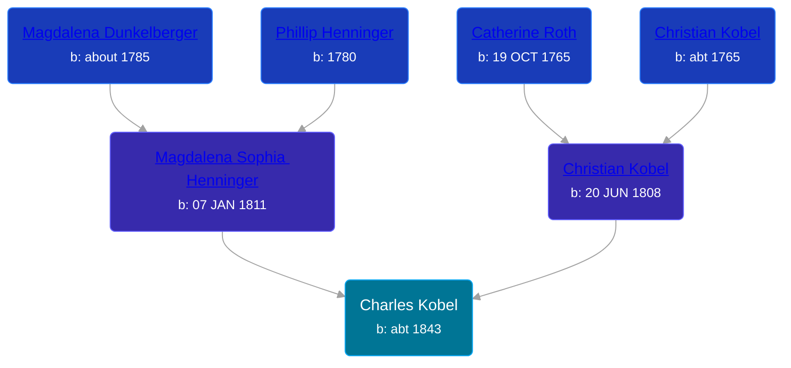

## 🔵 Charles Kobel

Son of [Christian Kobel](/people/1/17423128) and [Magdalena Sophia Henninger](/people/6/64241610)





### 📆 Events


Type | Date | Age at Event | Place
------ | ------ | ------ | ------
Birth | abt 1843 |  |



- **Birth**
**Date**: abt 1843, Age:
**Place**:

