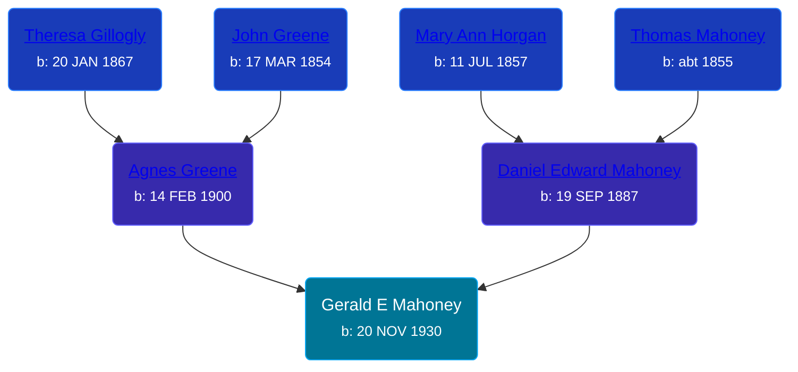

## 🔵 Gerald E Mahoney
<small>Age: 86y, 4m, 18d</small>

Son of [Daniel Edward Mahoney](/people/2/24117676) and [Agnes Greene](/people/1/15565254)





### 📆 Events


Type | Date | Age at Event | Place
------ | ------ | ------ | ------
Birth | 20 NOV 1930 |  |
[Residence](#event-event-0) | 1935 | 4y, 10d | Owosso, Shiawassee, Michigan, USA
[Residence](#event-event-1) | 19 APR 1940 | 9y, 4m, 29d | Owosso, Shiawassee, Michigan, USA
[Residence](#event-event-2) | 11 APR 1950 | 19y, 4m, 21d | Owosso, Shiawassee, Michigan, USA
[Death](#event-event-6) | 08 APR 2017 | 86y, 4m, 18d |
[Burial](#event-event-7) |  |  | Resurrection Cemetery, Wyoming, Kent, Michigan, USA



- **Birth**
**Date**: 20 NOV 1930, Age:
**Place**:
- **[Residence](#event-event-0)**
**Date**: 1935, Age: 4y, 10d
**Place**: Owosso, Shiawassee, Michigan, USA
- **[Residence](#event-event-1)**
**Date**: 19 APR 1940, Age: 9y, 4m, 29d
**Place**: Owosso, Shiawassee, Michigan, USA
- **[Residence](#event-event-2)**
**Date**: 11 APR 1950, Age: 19y, 4m, 21d
**Place**: Owosso, Shiawassee, Michigan, USA
- **[Death](#event-event-6)**
**Date**: 08 APR 2017, Age: 86y, 4m, 18d
**Place**:
- **[Burial](#event-event-7)**
**Date**:
**Place**: Resurrection Cemetery, Wyoming, Kent, Michigan, USA


## 👩‍❤️‍👨 Relationships

### 🟣 [Eleanore H. DeLonais](/people/4/45463626), b. 10 NOV 1932

#### Children With Eleanore H. DeLonais
* 🔵 [Living Person](/people/5/57716919)
* 🟣 [Living Person](/people/8/82431921)
* 🔵 [John Edward Mahoney](/people/2/20318131), b. 11 NOV 1961
* 🟣 [Living Person](/people/6/6203854)
### 📰 Event Sources

####  Residence, 1935
* 1940 US Census

####  Residence, 19 APR 1940
* 1940 US Census

####  Residence, 11 APR 1950
* 1950 US Census
>   
  > Name: Gerald F Mahoney  
  > Age: 19  
  > Birth Date: abt 1931  
  > Gender: Male  
  > Race: White  
  > Birth Place: Michigan  
  > Marital Status: Never Married (Single)  
  > Relation to Head of House: Son  
  > Residence Date: 1950  
  > Home in 1950: Owosso, Shiawassee, Michigan, USA  
  > Street Name: Howell  
  > House Number: 206  
  > Apartment Number: Lo  
  > Dwelling Number: 192  
  > Farm: No  
  > Occupation: Stock Boy  
  > Industry: Manufacturer Electric Motors  
  > Occupation Category: Working  
  > Hours Worked: 40  
  > Worker Class: Private  
  >   
  > Household members:  
  > D. Edward Mahoney, 62, Head  
  > Agnes Mahoney, 50, Wife  
  > Gerald F Mahoney, 19, Son  
  > Philip J Mahoney, 17, Son  
  > Thomas A Mahoney, 16, Son  
  >

####  Death, 08 APR 2017
* MLive
>   
  > Mahoney, Gerald E. Gerald E. Mahoney, aged 86 of Wyoming, was called home by his Lord Jesus Christ on Saturday, April 8, 2017. He was preceded in death by his parents, D. Edward and Agnes (Greene) Mahoney; his wife of 59 years, Eleanore (DeLonais) Mahoney; and his brother, Philip Mahoney. A U.S. Army veteran, Gerald served his country during the Korean Conflict and was awarded the Bronze Service Star along with the Presidential Unit Emblem. He was a barber for 51 years until he retired at age 75. He enjoyed dancing, classic movies, gardening, traveling and big band music. He will be sadly missed by his children, Dr. Ann (Ben) Knapp, John Mahoney, Mary (Chuck) Russcher, David (Debbie) Mahoney; nine grandchildren, Joshua, Sara & Kyle, Nathan, Katie, Hannah, Eric, Kyle and Jacob; brother and sisters-in-law, Tom (Carol) Mahoney, Marian Mahoney; and several nieces and nephews. A Mass of Christian Burial will be held on Wednesday at 11:00 am at St. John Vianney Church, 4101 Clyde Park SW, Wyoming with Fr. Jegar Fickel presiding. Interment Resurrection Cemetery. Relatives and friends may meet the family at the church on Wednesday from 10-11 am prior to the service. Memorial contributions may be made to the American Diabetes Association. Condolences may be sent online at www.mkdfuneralhome.com.

####  Burial
* findagrave.com
