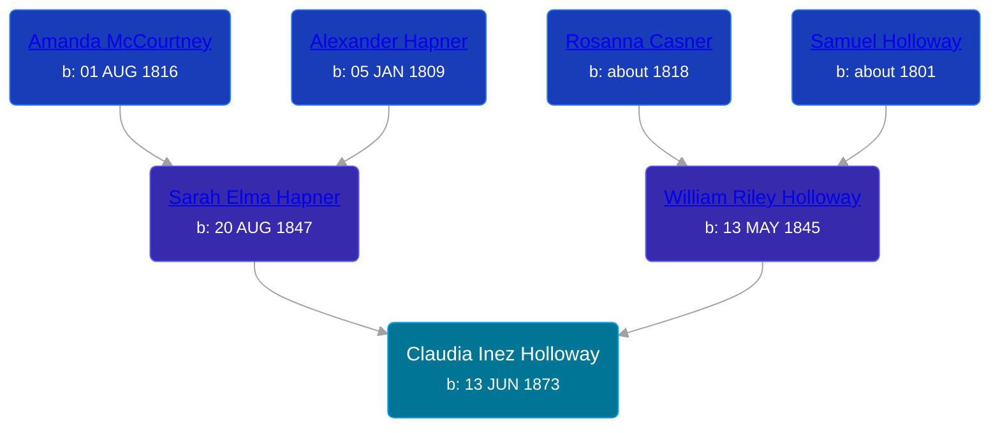

## 🟣 Claudia Inez Holloway
<small>Age: 60y, 2m</small>

Daughter of [William Riley Holloway](/people/9/90949012) and [Sarah Elma Hapner](/people/2/20173654)





### 📆 Events


Type | Date | Age at Event | Place
------ | ------ | ------ | ------
[Birth](#event-event-2) | 13 JUN 1873 |  | Chippewa Township, Isabella, Michigan, USA
[Death](#event-event-3) | 13 AUG 1933 | 60y, 2m | Mount Pleasant, Isabella, Michigan, USA



- **[Birth](#event-event-2)**
**Date**: 13 JUN 1873, Age:
**Place**: Chippewa Township, Isabella, Michigan, USA
- **[Death](#event-event-3)**
**Date**: 13 AUG 1933, Age: 60y, 2m
**Place**: Mount Pleasant, Isabella, Michigan, USA


### 📰 Event Sources

####  Birth, 13 JUN 1873
* Michigan, Births and Christenings Index, 1867-1911
>   
  > Name: Claude J Holloway  
  > Gender: Female  
  > Birth Place: Chippewa, Isabella Co, Michigan  
  > Birth Date: 18 Jun 1873  
  > Baptism Place: Isabella, Michigan  
  > Father's name: William R Holloway  
  > Mother's name: Sarah E  
  > FHL Film Number: 1005117

####  Death, 13 AUG 1933
* Michigan, Death Records, 1867-1950
>   
  > Place of Death: Mt. Pleasant, Isabella County, Michigan  
  > Name: Claudia Inez Secor  
  > Sex: Female  
  > Color: White  
  > Marital Status: Married  
  > Husband: George Secor  
  > Date of Birth: Jan 18 1873  
  > Age: 60 years, 6 months, 27 days  
  > Trade: At home  
  > Birthplace Isabella Co., Mich  
  > Father: William Holloway  
  > Birthplace: Indiana  
  > Mother: Sarah Hapner  
  > Birthplace: Indiana  
  > Informant: George Secor  
  > Burial: Aug 16, 1933  
  > Date of Death: Aug 14, 1933