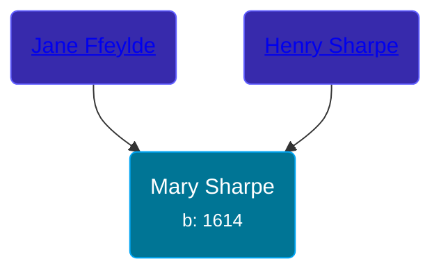

## 🟣 Mary Sharpe

Daughter of [Henry Sharpe](/people/4/46530053) and [Jane Ffeylde](/people/9/96496385)





### 📆 Events


Type | Date | Age at Event | Place
------ | ------ | ------ | ------
[Birth](#event-event-3) | 1614 |  | Horsmonden, Kent, England



- **[Birth](#event-event-3)**
**Date**: 1614, Age:
**Place**: Horsmonden, Kent, England


## 👩‍❤️‍👨 Relationships

### 🔵 [Simon Willard](/people/8/86485776), b. 1605

#### Events


Type | Date | Age at Event | Place
------ | ------ | ------ | ------
[Marriage](#event-family-0-event-0) |  |  |



- **[Marriage](#event-family-0-event-0)**
**Date**:
**Place**:


#### Children With Simon Willard
* 🟣 [Living Person](/people/4/45756022)
* 🟣 [Living Person](/people/3/39580887)
* 🔵 [Josiah Willard](/people/5/55775674), b. 1636
* 🔵 [Samuel Willard](/people/1/16157248), b. 31 JAN 1640
* 🟣 [Sarah Willard](/people/6/60626504), b. 27 JUN 1642
* 🟣 [Abovehope Willard](/people/6/68416569), b. 30 OCT 1646
* 🔵 [Simon Willard](/people/6/68962771), b. 23 NOV 1649
* 🔵 [Mary Willard](/people/8/86355995), b. 1653
### 📰 Event Sources

####  Birth, 1614
* Willard Memoir: Sketch of the Life of Maj. Simon Willard  - 3
####  Marriage
* Willard Memoir: Sketch of the Life of Maj. Simon Willard  - 3
