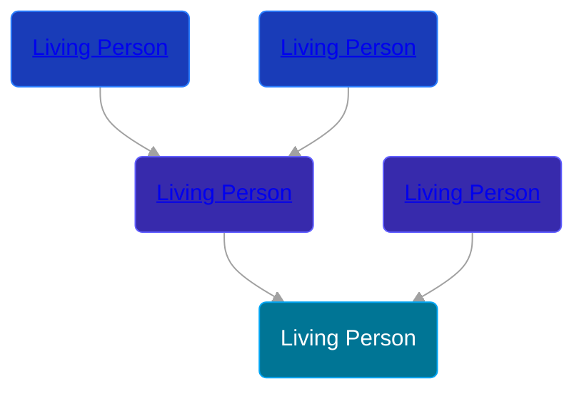

## 🟣 Living Person

Daughter of [Living Person](/people/9/90269553) and [Living Person](/people/3/3566860)



```mermaid
graph
classDef grands fill:#193cb8,stroke:#2b7fff,stroke-width:1px,color:#fff;
classDef parents fill:#372aac,stroke:#615fff,stroke-width:1px,color:#fff;
classDef primary fill:#007595,stroke:#00a6f4,stroke-width:1px,color:#fff;
11070342(Living Person):::primary
3566860(<a class="text-white" href="/people/3/3566860">Living Person</a>):::parents-->11070342
91180844(<a class="text-white" href="/people/9/91180844">Living Person</a>):::grands-->3566860
84637541(<a class="text-white" href="/people/8/84637541">Living Person</a>):::grands-->3566860
90269553(<a class="text-white" href="/people/9/90269553">Living Person</a>):::parents-->11070342
linkStyle default stroke:#a1a1a1
```

