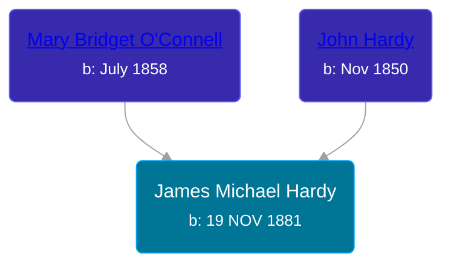

## 🔵 James Michael Hardy
<small>Age: 75y, 10m, 9d</small>

Son of [John Hardy](/people/5/56182816) and [Mary Bridget O'Connell](/people/4/47047024)





### 📆 Events


Type | Date | Age at Event | Place
------ | ------ | ------ | ------
[Birth](#event-event-2) | 19 NOV 1881 |  | Nebraska, USA
[Residence](#event-event-0) | 01 MAR 1885 | 3y, 3m, 12d | Rock Creek, Coffey, Kansas, USA
[Residence](#event-event-1) | 04 JUN 1900 | 18y, 6m, 15d | Omaha, Douglas, Nebraska, USA
[Residence](#event-event-2) | 27 APR 1910 | 28y, 5m, 8d | Brooklyn, Kings, New York, USA
[Residence](#event-event-3) | 08 JAN 1920 | 38y, 1m, 19d | Omaha, Douglas, Nebraska, USA
[Residence](#event-event-4) | 16 APR 1930 | 48y, 4m, 27d | Omaha, Douglas, Nebraska, USA
[Death](#event-event-8) | 28 SEP 1957 | 75y, 10m, 9d | Los Angeles, California, USA



- **[Birth](#event-event-2)**
**Date**: 19 NOV 1881, Age:
**Place**: Nebraska, USA
- **[Residence](#event-event-0)**
**Date**: 01 MAR 1885, Age: 3y, 3m, 12d
**Place**: Rock Creek, Coffey, Kansas, USA
- **[Residence](#event-event-1)**
**Date**: 04 JUN 1900, Age: 18y, 6m, 15d
**Place**: Omaha, Douglas, Nebraska, USA
- **[Residence](#event-event-2)**
**Date**: 27 APR 1910, Age: 28y, 5m, 8d
**Place**: Brooklyn, Kings, New York, USA
- **[Residence](#event-event-3)**
**Date**: 08 JAN 1920, Age: 38y, 1m, 19d
**Place**: Omaha, Douglas, Nebraska, USA
- **[Residence](#event-event-4)**
**Date**: 16 APR 1930, Age: 48y, 4m, 27d
**Place**: Omaha, Douglas, Nebraska, USA
- **[Death](#event-event-8)**
**Date**: 28 SEP 1957, Age: 75y, 10m, 9d
**Place**: Los Angeles, California, USA


## 👩‍❤️‍👨 Relationships

### 🟣 [Margaret P. Burke](/people/2/29782872), b. about 1883

#### Events


Type | Date | Age at Event | Place
------ | ------ | ------ | ------
[Marriage](#event-family-0-event-0) | 21 FEB 1909 | 27y, 3m, 2d | Brooklyn, Kings, New York, USA



- **[Marriage](#event-family-0-event-0)**
**Date**: 21 FEB 1909, Age: 27y, 3m, 2d
**Place**: Brooklyn, Kings, New York, USA


#### Children With Margaret P. Burke
* 🟣 [Living Person](/people/6/66419672)
* 🟣 [Living Person](/people/1/10368480)
* 🔵 [Living Person](/people/8/82881883)
* 🟣 [Anna Catherine Hardy](/people/2/25919759), b. 19 MAY 1914
* 🔵 [Living Person](/people/8/8915192)
* 🟣 [Living Person](/people/6/66380348)
* 🔵 [Living Person](/people/8/88206475)
### 📰 Event Sources

####  Birth, 19 NOV 1881
* U.S., World War I Draft Registration Cards, 1917-1918
>   
  > Name: James Michael Hardy  
  > City: Superior  
  > County: Douglas  
  > State: Wisconsin  
  > Birth Date: 19 Nov 1881  
  > Race: White  
  > Draft Board: 1
* U.S., World War II Draft Registration Cards, 1942
>   
  > Name: James Michael Hardy  
  > Age: 61  
  > Birth Date: 19 Nov 1881  
  > Residence Year: 1942  
  > Residence: Los Angeles, California

####  Residence, 01 MAR 1885
* Kansas State Census Collection, 1855-1925

####  Residence, 04 JUN 1900
* 1900 US Census

####  Marriage, 21 FEB 1909
* New York, New York, Marriage Index 1866-1937
>   
  > Name: James Hardy  
  > Gender: Male  
  > Marriage Date: 21 Feb 1909  
  > Marriage Place: Kings, New York, USA  
  > Spouse: Margaret Burke  
  > Certificate Number: 1984

####  Residence, 27 APR 1910
* 1910 US Census

####  Residence, 08 JAN 1920
* 1920 US Census

####  Residence, 16 APR 1930
* 1930 US Census
####  Death, 28 SEP 1957
* California, Death Index, 1940-1997
>   
  > Name: James M Hardy  
  > Gender: Male  
  > Birth Date: 19 Nov 1881  
  > Birth Place: Kansas  
  > Death Date: 28 Sep 1957  
  > Death Place: Los Angeles  
  > Mother's Maiden Name: Connell  
  > Father's Surname: Hardy
