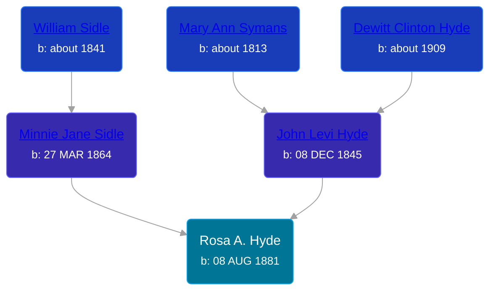

## 🟣 Rosa A. Hyde

Daughter of [John Levi Hyde](/people/2/23020300) and [Minnie Jane Sidle](/people/7/73883806)





### 📆 Events


Type | Date | Age at Event | Place
------ | ------ | ------ | ------
[Birth](#event-event-2) | 08 AUG 1881 |  | Newaygo, Michigan, USA



- **[Birth](#event-event-2)**
**Date**: 08 AUG 1881, Age:
**Place**: Newaygo, Michigan, USA


### 📰 Event Sources

####  Birth, 08 AUG 1881
* Unrecorded Births of Newaygo County
>   
  > Name: Hyde, Rosa A.  
  > DOB: Aug. 8, 1881  
  > Parents: Levi J. and Minnie Hyde