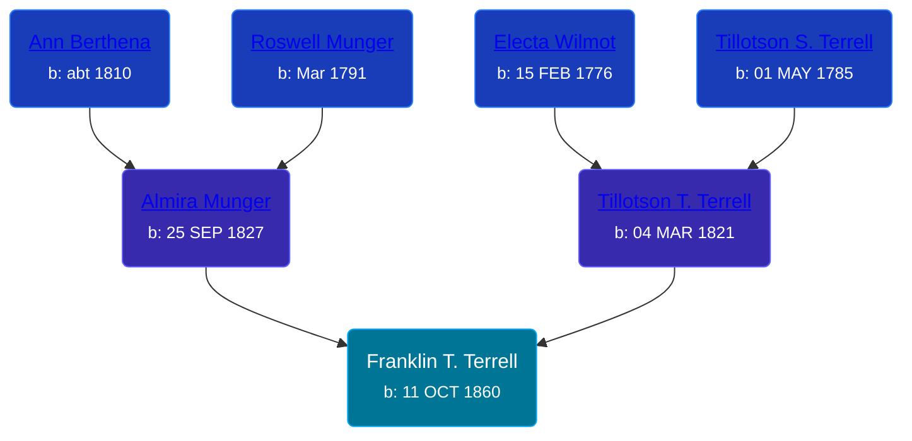

## 🔵 Franklin T. Terrell
<small>Age: 64y, 1d</small>

Son of [Tillotson T. Terrell](/people/5/59687792) and [Almira Munger](/people/3/36419408)





### 📆 Events


Type | Date | Age at Event | Place
------ | ------ | ------ | ------
[Birth](#event-event-2) | 11 OCT 1860 |  | Byron Township, Kent, Michigan, USA
[Residence](#event-event-0) | 16 AUG 1870 | 9y, 10m, 5d | Paris Township, Kent, Michigan, USA
[Death](#event-event-4) | 12 OCT 1924 | 64y, 1d | Michigan, USA



- **[Birth](#event-event-2)**
**Date**: 11 OCT 1860, Age:
**Place**: Byron Township, Kent, Michigan, USA
- **[Residence](#event-event-0)**
**Date**: 16 AUG 1870, Age: 9y, 10m, 5d
**Place**: Paris Township, Kent, Michigan, USA
- **[Death](#event-event-4)**
**Date**: 12 OCT 1924, Age: 64y, 1d
**Place**: Michigan, USA


### 📰 Event Sources

####  Birth, 11 OCT 1860
* Standard Atlas of Kent County, Michigan  - 108

####  Residence, 16 AUG 1870
* 1870 US Census

####  Death, 12 OCT 1924
* The Grand Rapids Press  - 13 October 1924, pg 22
>   
  > TERRELL -- Frank T. Terrell, aged 64, died Sunday morning at his home, 461 Adams st., S.E. He is survived by two sons, Cleveland S. and Leo G., and five grandchildren. Funeral services will be held Tuesday afternoon at 1 o'clock from the Paris township Baptist church, the Odd Fellows having charge. Interment at Pine Hill cemetery.