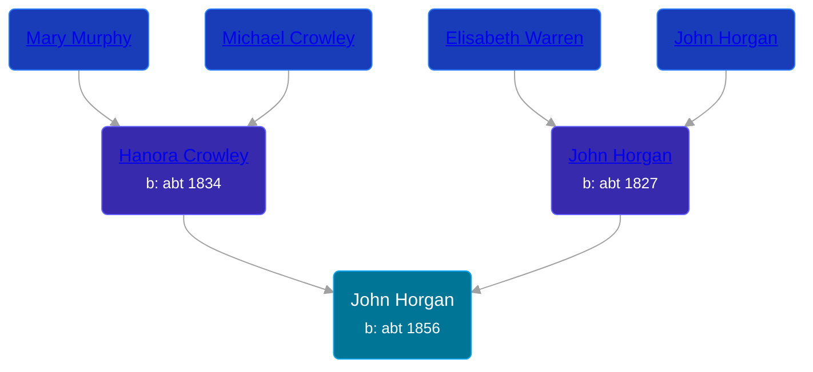

## 🔵 John Horgan

Son of [John Horgan](/people/5/54161773) and [Hanora Crowley](/people/7/72193795)





### 📆 Events


Type | Date | Age at Event | Place
------ | ------ | ------ | ------
Birth | abt 1856 |  | Canada
[Residence](#event-event-0) | 1861 | 5y | Ellice, Perth, Ontario, Canada
[Residence](#event-event-1) | 1871 | 15y | Perth, Ontario, Canada



- **Birth**
**Date**: abt 1856, Age:
**Place**: Canada
- **[Residence](#event-event-0)**
**Date**: 1861, Age: 5y
**Place**: Ellice, Perth, Ontario, Canada
- **[Residence](#event-event-1)**
**Date**: 1871, Age: 15y
**Place**: Perth, Ontario, Canada


### 📰 Event Sources

####  Residence, 1861
* 1861 Canada Census
>   
  > Name: John Horgan  
  > Sex: Male  
  > Age: 5y  
  > Birth Date: 1856  
  > Birthplace: U Canada  
  > Residence Date: 1861  
  > Residence Place: Ellice, Perth, Ontario, Canada  
  > Religion: Roman Catholic  
  > Event Type: Census  
  > Event Date: 1861  
  > Event Place: Ellice, Perth, Ontario, Canada  
  > Line Number: 23  
  > Sheet Number: 27  
  > Microfilm Number: 2435937  
  > Indexing Batch: N03134-7  
  >   
  > Household members:  
  > John Horgan, 34  
  > Honora, 27  
  > John, 5  
  > Mary Ann, 3  
  > Eleanor, 2  
  >

####  Residence, 1871
* 1871 Canada Census
>   
  > Name: John Horgan  
  > Sex: Male  
  > Age: 15 years  
  > Birth Date: 1856  
  > Birthplace: O  
  > Nationality: Irish  
  > Religion: Catholic  
  > Event Type: Census  
  > Event Date: 1871  
  > Event Place: Perth, Ontario, Canada  
  > Sub-District: Ellice  
  > Household Identifier: 1  
  > House Number: 1  
  > Line Number: 3  
  > Page Number: 1  
  >   
  > Household members:  
  > - John Horgan, M, 44  
  > - Hanorah Horgan, F, 37  
  > - John Horgan, M, 15  
  > - Mary Ann Horgan, F, 13  
  > - Ellan Horgan, F, 11  
  > - Daniel Horgan, M, 9  
  > - Cornalious Horgan, M, 7  
  > - Margret Horgan, F, 5  
  > - Bridgett Horgan, F, 3  
  >
