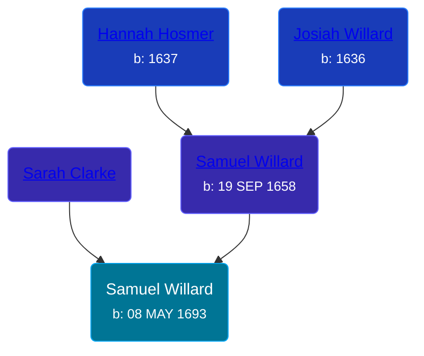

## 🔵 Samuel Willard
<small>Age: 86y, 7m, 19d</small>

Son of [Samuel Willard](/people/5/55389376) and [Sarah Clarke](/people/9/93595493)





### 📆 Events


Type | Date | Age at Event | Place
------ | ------ | ------ | ------
[Birth](#event-event-2) | 08 MAY 1693 |  | Saybrook, Middlesex, Connecticut, USA
[Death](#event-event-3) | 27 DEC 1779 | 86y, 7m, 19d | Saybrook, Middlesex, Connecticut, USA



- **[Birth](#event-event-2)**
**Date**: 08 MAY 1693, Age:
**Place**: Saybrook, Middlesex, Connecticut, USA
- **[Death](#event-event-3)**
**Date**: 27 DEC 1779, Age: 86y, 7m, 19d
**Place**: Saybrook, Middlesex, Connecticut, USA


## 👩‍❤️‍👨 Relationships

### 🟣 [Sarah Stillman](/people/9/9722974), b. 28 DEC 1694

#### Events


Type | Date | Age at Event | Place
------ | ------ | ------ | ------
[Marriage](#event-family-0-event-0) | 18 JAN 1715 | 21y, 8m, 10d | Saybrook, Middlesex, Connecticut, USA



- **[Marriage](#event-family-0-event-0)**
**Date**: 18 JAN 1715, Age: 21y, 8m, 10d
**Place**: Saybrook, Middlesex, Connecticut, USA


#### Children With Sarah Stillman
* 🔵 [Samuel Willard](/people/9/94843380), b. 06 SEP 1715
* 🟣 [Sarah Willard](/people/2/24374592), b. 18 MAY 1717
* 🟣 [Rebecca Willard](/people/6/62544636), b. 02 MAY 1719
* 🟣 [Hannah Willard](/people/7/75872420), b. 12 DEC 1720
* 🔵 [Elisha Willard](/people/6/625742), b. 09 FEB 1724
* 🔵 [George Willard](/people/3/31530910), b. 12 JUN 1726
* 🟣 [Martha Willard](/people/9/9026760), b. 16 MAR 1728
* 🔵 [Joseph Willard](/people/7/72246450), b. 18 MAY 1730
* 🔵 [Elisha Willard](/people/7/77525708), b. 13 JAN 1733
* 🔵 [Elisha Willard](/people/9/98758913), b. 12 AUG 1736
### 📰 Event Sources

####  Birth, 08 MAY 1693
* American Ancestry: Giving Name and Descent  - 95

####  Marriage, 18 JAN 1715
* American Ancestry: Giving Name and Descent  - 95
* The Foote Family: or the Descendants of Nathaniel Foote  - 283
####  Death, 27 DEC 1779
* American Ancestry: Giving Name and Descent  - 95
