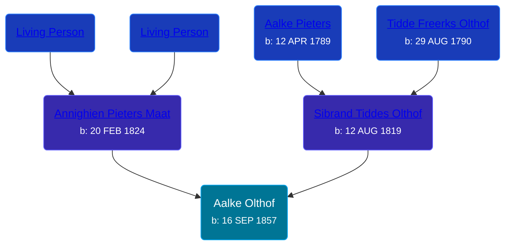

## 🟣 Aalke Olthof

Daughter of [Sibrand Tiddes Olthof](/people/7/76433820) and [Annighien Pieters Maat](/people/7/7249878)





### 📆 Events


Type | Date | Age at Event | Place
------ | ------ | ------ | ------
[Birth](#event-event-2) | 16 SEP 1857 |  | Loppersum, Netherlands



- **[Birth](#event-event-2)**
**Date**: 16 SEP 1857, Age:
**Place**: Loppersum, Netherlands


### 📰 Event Sources

####  Birth, 16 SEP 1857
* Dutch Civil Register
>   
  > Child: Aalke Olthof  
  > Gender: Woman  
  > Place of birth: Loppersum  
  > Date of birth: Wednesday, September 16, 1857  
  > Father: Sibrand Tiddes Olthof  
  > Age: 38  
  > Occupation: daglooner  
  > Mother: Annechien Pieters Maat  
  > Occupation: dagloonster  
  > Event: Geboorte  
  > Date: Wednesday, September 16, 1857  
  > Event place: Loppersum