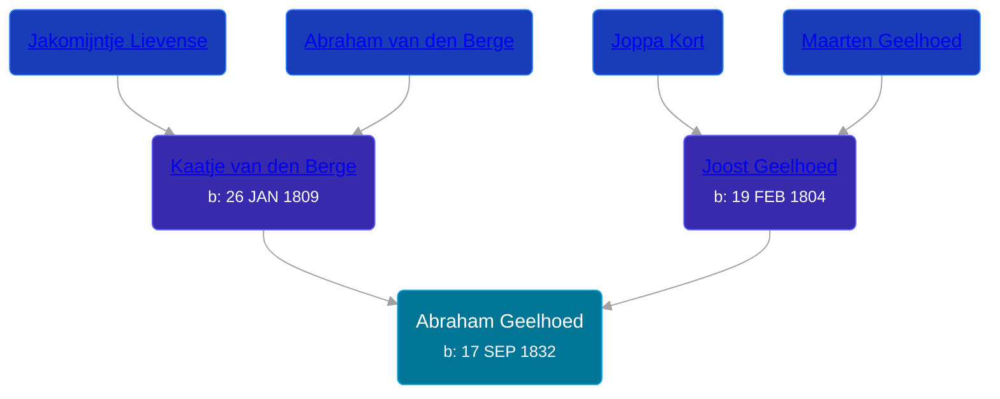

## 🔵 Abraham Geelhoed
<small>Age: 2d</small>

Son of [Joost Geelhoed](/people/7/72031888) and [Kaatje van den Berge](/people/3/32271874)





### 📆 Events


Type | Date | Age at Event | Place
------ | ------ | ------ | ------
[Birth](#event-event-2) | 17 SEP 1832 |  | Dreischor, Zeeland, Netherlands
[Death](#event-event-3) | 19 SEP 1832 | 2d | Dreischor, Zeeland, Netherlands



- **[Birth](#event-event-2)**
**Date**: 17 SEP 1832, Age:
**Place**: Dreischor, Zeeland, Netherlands
- **[Death](#event-event-3)**
**Date**: 19 SEP 1832, Age: 2d
**Place**: Dreischor, Zeeland, Netherlands


### 📰 Event Sources

####  Birth, 17 SEP 1832
* Geelhoet, Geelhoed & Geelhoedt Genealogie

####  Death, 19 SEP 1832
* Geelhoet, Geelhoed & Geelhoedt Genealogie