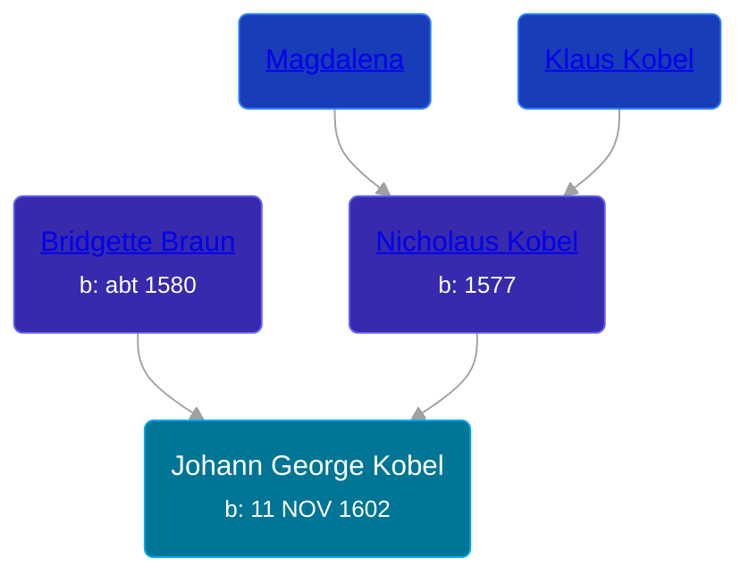

## 🔵 Johann George Kobel
<small>Age: 43y, 19d</small>

Son of [Nicholaus Kobel](/people/4/41497852) and [Bridgette Braun](/people/8/81499716)





### 📆 Events


Type | Date | Age at Event | Place
------ | ------ | ------ | ------
Birth | 11 NOV 1602 |  | Nordlengen, Donauworth, Germany
Death | abt 1646 | 43y, 19d | Nordlengen, Donauworth, Germany



- **Birth**
**Date**: 11 NOV 1602, Age:
**Place**: Nordlengen, Donauworth, Germany
- **Death**
**Date**: abt 1646, Age: 43y, 19d
**Place**: Nordlengen, Donauworth, Germany


## 👩‍❤️‍👨 Relationships

### 🟣 [Sybilla Schweichler](/people/1/19897612)

#### Events


Type | Date | Age at Event | Place
------ | ------ | ------ | ------
Marriage | 11 NOV 1627 | 25y | Nordlengen, Donauworth, Germany



- **Marriage**
**Date**: 11 NOV 1627, Age: 25y
**Place**: Nordlengen, Donauworth, Germany


#### Children With Sybilla Schweichler
* 🔵 [Nicholaus Bernhard Kobel](/people/5/51558544), b. 28 FEB 1627
### 📰 Event Sources

####  Marriage, 11 NOV 1627
