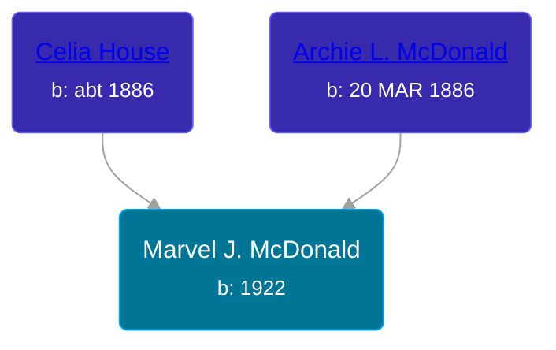

## 🟣 Marvel J. McDonald
<small>Age: 39y</small>

Daughter of [Archie L. McDonald](/people/5/52644506) and [Celia House](/people/6/69305794)





### 📆 Events


Type | Date | Age at Event | Place
------ | ------ | ------ | ------
Birth | 1922 |  | Grand Rapids, Kent, Michigan, United States
[Residence](#event-event-0) | 17 APR 1940 | 18y, 4m, 17d | Grand Rapids, Kent, Michigan, United States
Death | 1961 | 39y |
[Burial](#event-event-6) |  |  | Spring Lake Cemetery, Spring Lake, Ottawa, Michigan, USA



- **Birth**
**Date**: 1922, Age:
**Place**: Grand Rapids, Kent, Michigan, United States
- **[Residence](#event-event-0)**
**Date**: 17 APR 1940, Age: 18y, 4m, 17d
**Place**: Grand Rapids, Kent, Michigan, United States
- **Death**
**Date**: 1961, Age: 39y
**Place**:
- **[Burial](#event-event-6)**
**Date**:
**Place**: Spring Lake Cemetery, Spring Lake, Ottawa, Michigan, USA


## 👩‍❤️‍👨 Relationships

### 🔵 [Fletcher Maxwell Wilson](/people/3/32597724), b. 03 JUN 1913

#### Events


Type | Date | Age at Event | Place
------ | ------ | ------ | ------
[Marriage](#event-family-0-event-0) | 26 SEP 1936 | 14y, 9m, 26d | Grand Rapids, Kent, Michigan, United States
[Divorce](#event-family-0-event-1) | 01 SEP 1943 | 21y, 9m, 1d | Grand Rapids, Kent, Michigan, United States



- **[Marriage](#event-family-0-event-0)**
**Date**: 26 SEP 1936, Age: 14y, 9m, 26d
**Place**: Grand Rapids, Kent, Michigan, United States
- **[Divorce](#event-family-0-event-1)**
**Date**: 01 SEP 1943, Age: 21y, 9m, 1d
**Place**: Grand Rapids, Kent, Michigan, United States


#### Children With Fletcher Maxwell Wilson
* 🔵 [Living Person](/people/5/53774374)
* 🔵 [Marvin Jean Wilson](/people/4/40728128), b. 25 OCT 1939
* 🟣 [Judith Ann Wilson](/people/5/50745588), b. 05 OCT 1940
### 🔵 [Raymond Richardson](/people/2/26408903), b. 1915

#### Events


Type | Date | Age at Event | Place
------ | ------ | ------ | ------
[Marriage](#event-family-1-event-0) | 25 AUG 1951 | 29y, 8m, 25d | Spring Lake, Ottawa, Michigan, USA



- **[Marriage](#event-family-1-event-0)**
**Date**: 25 AUG 1951, Age: 29y, 8m, 25d
**Place**: Spring Lake, Ottawa, Michigan, USA


### 📰 Event Sources

####  Residence, 17 APR 1940
* 1940 US Census
>   
  > Name: Marvel J Wilson    
  > Respondent: Yes    
  > Age: 19    
  > Estimated Birth Year: abt 1921    
  > Gender: Female    
  > Race: White    
  > Birthplace: Michigan    
  > Marital Status: Married    
  > Relation to Head of House: Wife    
  > Home in 1940: Grand Rapids, Kent, Michigan    
  > Map of Home in 1940:    
  > Street: Tzplan Ave NE    
  > House Number: 1210    
  > Inferred Residence in 1935: Grand Rapids, Kent, Michigan    
  > Residence in 1935: Grand Rapids    
  > Sheet Number: 14A    
  > Attended School or College: No    
  > Highest Grade Completed: High School, 2nd year    
  > Weeks Worked in 1939: 0    
  > Income: 0    
  > Income Other Sources: No    
  >   
  > Household members:  
  > Fletcher M Wilson, 27, Head  
  > Marvel J Wilson, 19, Wife  
  > William D Wilson, 2, Son  
  > Marvin G Wilson, 5/12, Son  
  >

####  Burial
* findagrave.com

####  Marriage, 26 SEP 1936
* Kent County Marriage Records
>   
  > Date of Record: 21 Sep 1936  
  > Date of Marriage: 26 Sep 1936  
  > Place of Marriage: Grand Rapids, Kent County, Michigan  
  > Groom: Max F. Wilson  
  > Bride: Marvel J. McDonald  
  > Groom's Birthplace: Kent County, Michigan  
  > Groom's Parents: Joseph Wilson and Orpha Hyde  
  > Groom's Prev. Marriages: 0  
  > Bride's Birthplace: Grand Rapids, Kent County, Michigan  
  > Bride's Parents: Archie McDonald and Celia House  
  > Bride's Prev. Marriages: 0

####  Divorce, 01 SEP 1943
* Michigan, Divorce Records, 1897-1952
>   
  > Name: Fletcher M Wilson  
  > Marriage Date: 26 Sep 1936  
  > Marriage Place: Grand Rapids, Michigan  
  > Decree Date: 1 Sep 1943  
  > Decree Place: Kent  
  > Spouse Name: Marvel Wilson  
  > State File Number: 41 10734  
  > Docket Number: 45867  
  > Number of Children: 3  
  > Divorce Status: Granted
####  Marriage, 25 AUG 1951
* Michigan, Marriage Records, 1867-1952
>   
  > Name: Marvel June Parker  
  > Gender: Female  
  > Race: White  
  > Age: 31  
  > Birth Date: 1920  
  > Birth Place: Grand Rapids, Michigan  
  > Marriage License Place: Ottawa  
  > Marriage Date: 25 Aug 1951  
  > Marriage Place: Spring Lake, Ottawa, Michigan, USA  
  > Residence Place: Spring Lake, Michigan  
  > Father: Archie Mac Donald  
  > Mother: Celia House  
  > Spouse: Raymond Richardson  
  > Spouse Gender: Male  
  > Spouse Race: White  
  > Spouse Age: 36  
  > Spouse Birth Date: abt 1915  
  > Spouse Birth Place: Ferrysburg, Michigan  
  > Spouse Residence Place: Ferrysburg, Michigan  
  > Spouse Father: Melvin Ray Richardson  
  > Spouse Mother: Margaret Mink  
  > County File Number: 384  
  > State File Number: 70 13384  
  >
