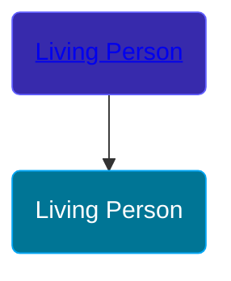

## 🔵 Living Person

Son of [Living Person](/people/1/18284468)





## 👩‍❤️‍👨 Relationships

### 🟣 [Anna Maria Hauer](/people/2/22963774), b. about 1720

#### Children With Anna Maria Hauer
* 🟣 [Catherine Dunkelberger](/people/1/19744824), b. about 1740
* 🟣 [Anna Maria Dunkelberger](/people/2/28076308), b. about 1742
* 🔵 [Johannes Jacob Dunkelberger](/people/3/3659869), b. 08 OCT 1744
* 🔵 [Frederick Dunkelberger](/people/2/29307544), b. 24 APR 1747
* 🔵 [Christopher Dunkelberger](/people/8/88832375), b. about 1749
* 🟣 [Maria Elizabeth Dunkelberger](/people/6/68027592), b. about 1749
* 🔵 [Philip Dunkelberger](/people/6/68247643), b. about 1750
* 🔵 [Clement Dunkelberger](/people/7/75287884), b. about 1752
* 🟣 [Sevilla Dunkelberger](/people/4/44893832), b. about 1754
* 🟣 [Magdalena Dunkelberger](/people/5/57016064), b. about 1756
* 🟣 [Dorthea Dunkelberger](/people/5/56682191), b. about 1758