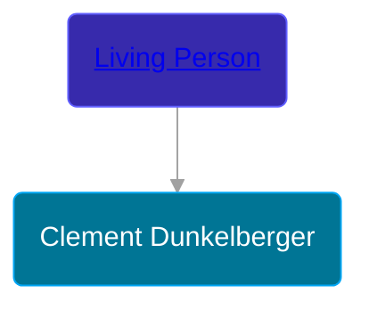

## 🔵 Clement Dunkelberger

Son of [Living Person](/people/1/18284468)



```mermaid
graph
classDef grands fill:#193cb8,stroke:#2b7fff,stroke-width:1px,color:#fff;
classDef parents fill:#372aac,stroke:#615fff,stroke-width:1px,color:#fff;
classDef primary fill:#007595,stroke:#00a6f4,stroke-width:1px,color:#fff;
13545057(Clement Dunkelberger):::primary
18284468(<a class="text-white" href="/people/1/18284468">Living Person</a>):::parents-->13545057
linkStyle default stroke:#a1a1a1
```


### 📆 Events


Type | Date | Age at Event | Place
------ | ------ | ------ | ------
[Birth](#event-event-0) |  |  | Nordrhein-Westfalen, Germany
[Baptism](#event-event-1) | 03 JUN 1705 | undefined | Solingen, Nordrhein-Westfalen, Germany
[Confirmation](#event-event-2) | 30 DEC 1723 | undefined | Evangelic Reformed Church, Solingen, Nordrhein-Westfalen, Germany
[Immigration](#event-event-3) | 23 AUG 1728 | undefined | Philadelphia, Pennsylvania, USA



- **[Birth](#event-event-0)**
**Date**:
**Place**: Nordrhein-Westfalen, Germany
- **[Baptism](#event-event-1)**
**Date**: 03 JUN 1705, Age: undefined
**Place**: Solingen, Nordrhein-Westfalen, Germany
- **[Confirmation](#event-event-2)**
**Date**: 30 DEC 1723, Age: undefined
**Place**: Evangelic Reformed Church, Solingen, Nordrhein-Westfalen, Germany
- **[Immigration](#event-event-3)**
**Date**: 23 AUG 1728, Age: undefined
**Place**: Philadelphia, Pennsylvania, USA


## 👩‍❤️‍👨 Relationships

### 🟣 [Anna Maria Hauer](/people/2/22963774), b. about 1720

#### Children With Anna Maria Hauer
* 🟣 [Catherine Dunkelberger](/people/1/19744824), b. about 1740
* 🟣 [Anna Maria Dunkelberger](/people/2/28076308), b. about 1742
* 🔵 [Johannes Jacob Dunkelberger](/people/3/3659869), b. 08 OCT 1744
* 🔵 [Frederick Dunkelberger](/people/2/29307544), b. 24 APR 1747
* 🔵 [Christopher Dunkelberger](/people/8/88832375), b. about 1749
* 🟣 [Maria Elizabeth Dunkelberger](/people/6/68027592), b. about 1749
* 🔵 [Philip Dunkelberger](/people/6/68247643), b. about 1750
* 🔵 [Clement Dunkelberger](/people/7/75287884), b. about 1752
* 🟣 [Sevilla Dunkelberger](/people/4/44893832), b. about 1754
* 🟣 [Magdalena Dunkelberger](/people/5/57016064), b. about 1756
* 🟣 [Dorthea Dunkelberger](/people/5/56682191), b. about 1758
### 📰 Event Sources

####  Birth
* Roy Fletcher Stohler's Research

####  Baptism, 03 JUN 1705
* The Dunkelberger Family: Europe to America, 1600-1982 - 21

####  Confirmation, 30 DEC 1723
* The Dunkelberger Family: Europe to America, 1600-1982

####  Immigration, 23 AUG 1728
* The Dunkelberger Family: Europe to America, 1600-1982
