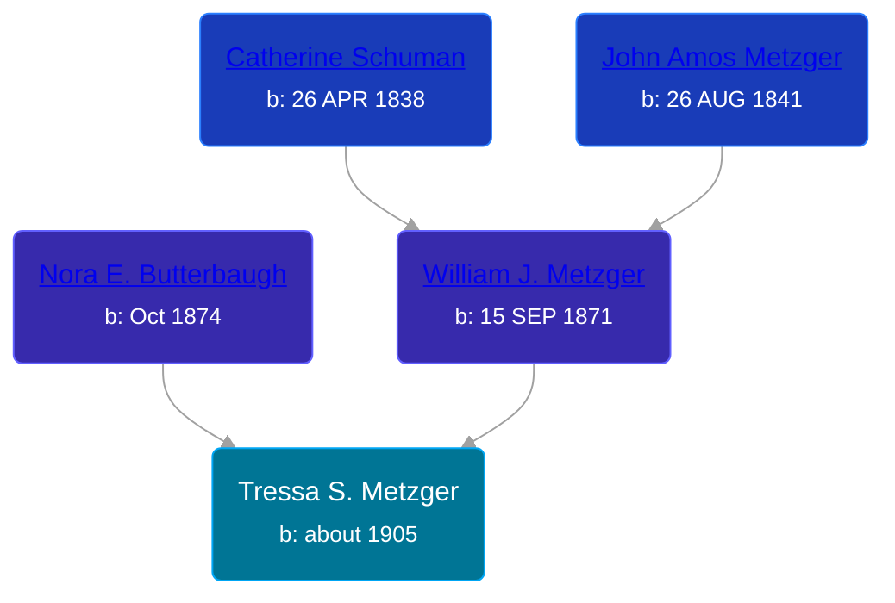

## 🟣 Tressa S. Metzger

Daughter of [William J. Metzger](/people/2/26066694) and [Nora E. Butterbaugh](/people/7/71546258)





### 📆 Events


Type | Date | Age at Event | Place
------ | ------ | ------ | ------
Birth | about 1905 |  | Indiana, USA
[Residence](#event-event-0) | 1910 | 5y | Pleasant Township, Wabash, Indiana, USA
[Residence](#event-event-1) | 1920 | 15y | Pleasant Township, Wabash, Indiana, USA
[Residence](#event-event-2) | 1930 | 25y | Pleasant Township, Wabash, Indiana, USA



- **Birth**
**Date**: about 1905, Age:
**Place**: Indiana, USA
- **[Residence](#event-event-0)**
**Date**: 1910, Age: 5y
**Place**: Pleasant Township, Wabash, Indiana, USA
- **[Residence](#event-event-1)**
**Date**: 1920, Age: 15y
**Place**: Pleasant Township, Wabash, Indiana, USA
- **[Residence](#event-event-2)**
**Date**: 1930, Age: 25y
**Place**: Pleasant Township, Wabash, Indiana, USA


### 📰 Event Sources

####  Residence, 1910
* 1910 US Census

####  Residence, 1920
* 1920 US Census

####  Residence, 1930
* 1930 US Census
