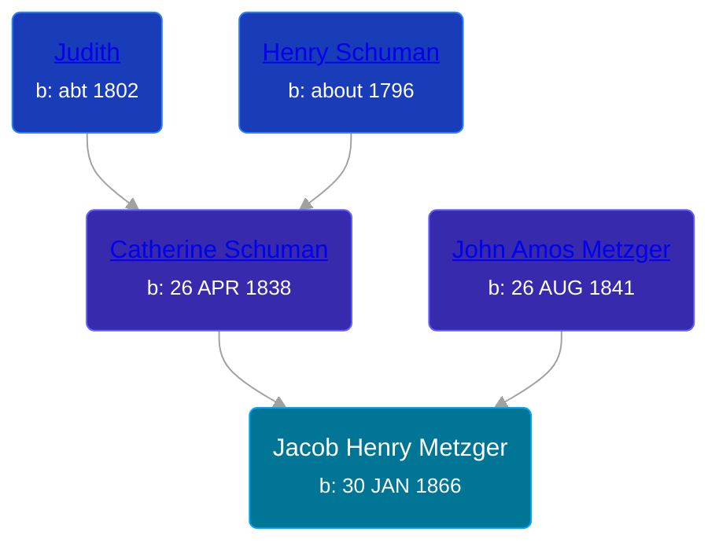

## 🔵 Jacob Henry Metzger
<small>Age: 63y, 10m, 9d</small>

Son of [John Amos Metzger](/people/2/28893894) and [Catherine Schuman](/people/3/39599940)





### 📆 Events


Type | Date | Age at Event | Place
------ | ------ | ------ | ------
Birth | 30 JAN 1866 |  | Clark, Ohio, USA
[Residence](#event-event-0) | 1870 | 3y, 10m | Troy Township, Whitley, Indiana, USA
[Residence](#event-event-1) | 1880 | 13y, 10m | Richland, Whitley, Indiana, USA
[Residence](#event-event-2) | 21 JUN 1900 | 34y, 4m, 21d | Richland, Whitley, Indiana, USA
[Residence](#event-event-3) | 27 APR 1910 | 44y, 2m, 27d | Columbia, Whitley, Indiana, USA
[Residence](#event-event-4) | 10 FEB 1920 | 54y, 10d | Columbia, Whitley, Indiana, USA
[Death](#event-event-8) | 09 DEC 1929 | 63y, 10m, 9d | Columbia, Whitley, Indiana, USA
[Burial](#event-event-9) |  |  | South Park Annex Cemetery, Columbia, Whitley, Indiana, USA



- **Birth**
**Date**: 30 JAN 1866, Age:
**Place**: Clark, Ohio, USA
- **[Residence](#event-event-0)**
**Date**: 1870, Age: 3y, 10m
**Place**: Troy Township, Whitley, Indiana, USA
- **[Residence](#event-event-1)**
**Date**: 1880, Age: 13y, 10m
**Place**: Richland, Whitley, Indiana, USA
- **[Residence](#event-event-2)**
**Date**: 21 JUN 1900, Age: 34y, 4m, 21d
**Place**: Richland, Whitley, Indiana, USA
- **[Residence](#event-event-3)**
**Date**: 27 APR 1910, Age: 44y, 2m, 27d
**Place**: Columbia, Whitley, Indiana, USA
- **[Residence](#event-event-4)**
**Date**: 10 FEB 1920, Age: 54y, 10d
**Place**: Columbia, Whitley, Indiana, USA
- **[Death](#event-event-8)**
**Date**: 09 DEC 1929, Age: 63y, 10m, 9d
**Place**: Columbia, Whitley, Indiana, USA
- **[Burial](#event-event-9)**
**Date**:
**Place**: South Park Annex Cemetery, Columbia, Whitley, Indiana, USA


## 👩‍❤️‍👨 Relationships

### 🟣 [Cora A. Miller](/people/1/12053368), b. 15 MAR 1865

#### Events


Type | Date | Age at Event | Place
------ | ------ | ------ | ------
[Marriage](#event-family-0-event-0) | 08 MAR 1888 | 22y, 1m, 8d | Larwill, Whitley, Indiana, USA



- **[Marriage](#event-family-0-event-0)**
**Date**: 08 MAR 1888, Age: 22y, 1m, 8d
**Place**: Larwill, Whitley, Indiana, USA


#### Children With Cora A. Miller
* 🔵 [William Ralph Metzger](/people/6/66898263), b. 20 JUN 1890
* 🟣 [Hazel Pearl Metzger](/people/3/32407695), b. 13 MAY 1894
* 🔵 [Clarence Roy Metzger](/people/6/64680964), b. 26 APR 1896
### 📰 Event Sources

####  Residence, 1870
* 1870 US Census

####  Residence, 1880
* 1880 US Census

####  Residence, 21 JUN 1900
* 1900 US Census
>   
  > Name: Jacob Metzger  
  > Age: 35  
  > Birth Date: Jan 1865  
  > Birthplace: Ohio, USA  
  > Home in 1900: Richland, Whitley, Indiana  
  > Sheet Number: 13  
  > Number of Dwelling in Order of Visitation: 293  
  > Family Number: 298  
  > Race: White  
  > Gender: Male  
  > Relation to Head of House: Head  
  > Marital Status: Married  
  > Spouse's Name: Cora Metzger  
  > Marriage Year: 1888  
  > Years Married: 12  
  > Father's Birthplace: Pennsylvania, USA  
  > Mother's Birthplace: Ohio, USA  
  > Occupation: Farmer  
  > Months Not Employed: 0  
  > Can Read: Y  
  > Can Write: Y  
  > Can Speak English: Y  
  > House Owned or Rented: Rent  
  > Farm or House: H

####  Residence, 27 APR 1910
* 1910 US Census
>   
  > Name: Jacob H Metzger  
  > Age in 1910: 44  
  > Birth Date: 1866  
  > Birthplace: Ohio  
  > Home in 1910: Columbia, Whitley, Indiana, USA  
  > Race: White  
  > Gender: Male  
  > Relation to Head of House: Head  
  > Marital Status: Married  
  > Spouse's Name: Cora Metzger  
  > Father's Birthplace: Pennsylvania  
  > Mother's Birthplace: Ohio  
  > Native Tongue: English  
  > Occupation: Farmer  
  > Industry: General Farm  
  > Employer, Employee or Other: Own Account  
  > Home Owned or Rented: Own  
  > Home Free or Mortgaged: Free  
  > Farm or House: Farm  
  > Able to read: Yes  
  > Able to Write: Yes  
  > Years Married: 22

####  Residence, 10 FEB 1920
* 1920 US Census

####  Death, 09 DEC 1929
* Indiana, Death Certificates, 1899-2011
>   
  > Name:Jacob Henry Metzger  
  > Gender:Male  
  > Race:White  
  > Age:63  
  > Birth Date:30 Jan 1866  
  > Birth Place:Ohio  
  > Death Date:9 Dec 1929  
  > Death Place:Columbia, Whitley, Indiana, USA  
  > Cause: Cerebral Hemorrhage Apoplexy  
  > Place of Burial: South Park Cemetery  
  > Date of Burial: Dec 11, 1929  
  > Occupation: Farmer  
  > Marital Status:Married  
  > Spouse:Cora Metzger  
  > Father:John Metzger  
  > Birthplace: Pa  
  > Mother:Catherine Schuman  
  > Birthplace: Ohio
* The Columbia City Post  - 12 Dec 1929, Page 2

####  Burial
* South Park Cemetery
>   
  > Metzger Jacob H - born 1866 died 1929 2 names Cora - South Park Annex-A-42-7-2

####  Marriage, 08 MAR 1888
* Indiana, Marriages, 1810-2001
>   
  > Record No: 21  
  > Full Name of Groom: Jacob H. Metzger  
  > Place of Residence: Larwill, Ind.  
  > Occupation: Farmer  
  > Age next Birthday: 23  
  > Race and Color: White  
  > Place of Birth: Clark Co., Ohio  
  > Nationality: American  
  > Father's Name:   
  > Mother's Maiden Name:   
  > No of Groom's Marriages:  
  > Full Name of Bride: Cora A. Miller  
  > Maiden Name, if a Widow: ---  
  > Place of Residence: Larwill, Ind.  
  > Occupation:  
  > Age next Birthday: 21   
  > Race and Color: White  
  > Place of Birth: Larwill, Ind.  
  > Nationality: American  
  > Father's Name: William Miller  
  > Mother's Maiden Name: Mary E. Miller  
  > No. of Bride's Marriages: First  
  > Where and When Married: Larwill, Ind. March 8, 1888  
  > Witnesses:   
  > By whom: Rev. C. H. Rockey