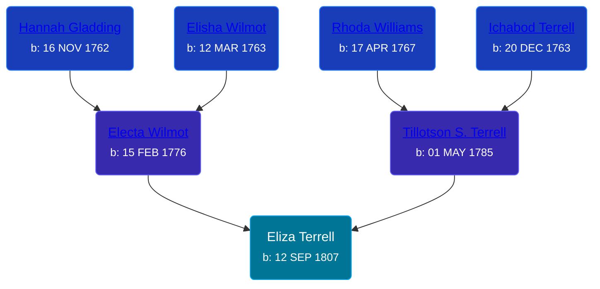

## 🔵 Eliza Terrell
<small>Age: 85y, 6m, 24d</small>

Son of [Tillotson S. Terrell](/people/2/25548435) and [Electa Wilmot](/people/7/77370498)





### 📆 Events


Type | Date | Age at Event | Place
------ | ------ | ------ | ------
Birth | 12 SEP 1807 |  | Waterbury, New Haven, Connecticut, USA
Death | 06 APR 1893 | 85y, 6m, 24d | Kent, Michigan, USA
[Burial](#event-event-4) |  |  | Winchester Cemetery, Byron Township, Kent, Michigan, USA



- **Birth**
**Date**: 12 SEP 1807, Age:
**Place**: Waterbury, New Haven, Connecticut, USA
- **Death**
**Date**: 06 APR 1893, Age: 85y, 6m, 24d
**Place**: Kent, Michigan, USA
- **[Burial](#event-event-4)**
**Date**:
**Place**: Winchester Cemetery, Byron Township, Kent, Michigan, USA


### 📰 Event Sources

####  Burial
* Winchester Cemetery
>   
  > Peters, Eliza (Mother)  
  > w. of Rev, Wm; d. Apr 6, 1893; a. 85y 8m
