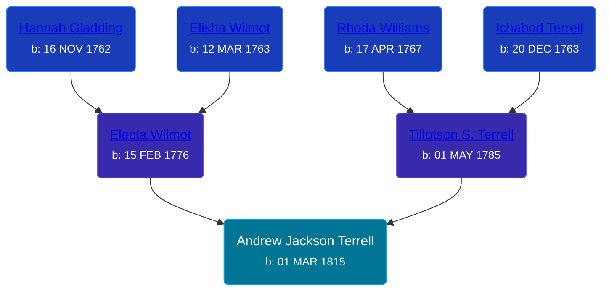

## 🔵 Andrew Jackson Terrell
<small>Age: 85y, 7m, 4d</small>

Son of [Tillotson S. Terrell](/people/2/25548435) and [Electa Wilmot](/people/7/77370498)





### 📆 Events


Type | Date | Age at Event | Place
------ | ------ | ------ | ------
Birth | 01 MAR 1815 |  | Ohio, USA
[Death](#event-event-3) | 05 OCT 1900 | 85y, 7m, 4d | Byron Township, Kent, Michigan, USA
[Burial](#event-event-4) | 09 OCT 1900 | 85y, 7m, 8d | Winchester Cemetery, Byron Township, Kent, Michigan, USA



- **Birth**
**Date**: 01 MAR 1815, Age:
**Place**: Ohio, USA
- **[Death](#event-event-3)**
**Date**: 05 OCT 1900, Age: 85y, 7m, 4d
**Place**: Byron Township, Kent, Michigan, USA
- **[Burial](#event-event-4)**
**Date**: 09 OCT 1900, Age: 85y, 7m, 8d
**Place**: Winchester Cemetery, Byron Township, Kent, Michigan, USA


### 📰 Event Sources

####  Death, 05 OCT 1900
* Kent County Death Records  - Book 5, Page 225, Record 12564

####  Burial, 09 OCT 1900
* Winchester Cemetery
>   
  > Terrell, Andrew J.  
  > b. Mar 1, 1815; d. Oct 5, 1900
