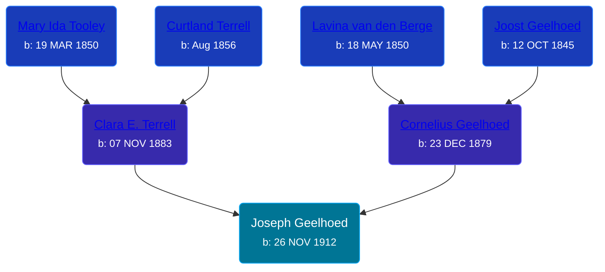

## 🔵 Joseph Geelhoed
<small>Age: 77y, 5m, 27d</small>

Son of [Cornelius Geelhoed](/people/9/92844960) and [Clara E. Terrell](/people/6/62490094)





### 📆 Events


Type | Date | Age at Event | Place
------ | ------ | ------ | ------
[Birth](#event-event-2) | 26 NOV 1912 |  | Grand Rapids, Kent, Michigan, United States
[Residence](#event-event-0) | 1920 | 7y, 4d | Paris Township, Kent, Michigan, USA
[Residence](#event-event-1) | 1930 | 17y, 4d | Cascade, Kent, Michigan, USA
[Death](#event-event-5) | 23 MAY 1990 | 77y, 5m, 27d | Cascade, Kent, Michigan, USA
Burial | 26 MAY 1990 | 77y, 6m | Pine Hill Cemetery, Kentwood, Kent, Michigan, USA



- **[Birth](#event-event-2)**
**Date**: 26 NOV 1912, Age:
**Place**: Grand Rapids, Kent, Michigan, United States
- **[Residence](#event-event-0)**
**Date**: 1920, Age: 7y, 4d
**Place**: Paris Township, Kent, Michigan, USA
- **[Residence](#event-event-1)**
**Date**: 1930, Age: 17y, 4d
**Place**: Cascade, Kent, Michigan, USA
- **[Death](#event-event-5)**
**Date**: 23 MAY 1990, Age: 77y, 5m, 27d
**Place**: Cascade, Kent, Michigan, USA
- **Burial**
**Date**: 26 MAY 1990, Age: 77y, 6m
**Place**: Pine Hill Cemetery, Kentwood, Kent, Michigan, USA


### 📰 Event Sources

####  Birth, 26 NOV 1912
* Michigan, U.S., Birth Records, 1867-1914
>   
  > Name: Joseph Geelhoed  
  > Gender: Male  
  > Birth Date: 26 Nov 1912  
  > Birth Place: Grand Rapids, Michigan, USA  
  > Father: Cornelius Geelhoed  
  > Mother: Clara Terrell  
  > Jurisdiction Number: 1-189  
  > Reference Number: 14C  
  >

####  Residence, 1920
* 1920 US Census

####  Residence, 1930
* 1930 US Census

####  Death, 23 MAY 1990
* U.S., Social Security Death Index, 1935-2014
>   
  > Name: JOSEPH GEELHOED  
  > Born: 26 Nov 1912  
  > Died: 23 May 1990  
  > Last Residence: (not specified)  
  > Last Benefit: (none specified)  
  > SSN: ###-##-####  
  > Issued: Michigan
* The Grand Rapids Press  - 20 Nov 1990
>   
  > GEELHOED - Joseph Geelhoed, aged 77, of Ada, passed away Wednesday, May 23, 1990. He is survived by his wife, Margaret; children, Mrs. Howard (Jean) Acheson of Lowell, Mrs. Edward (Donna) VanderLaan of Kentwood, Don and Barbara Geelhoed of Ada, Mrs. James (Eleanor) Serne of Ada, Mrs. Harold (Loraine) Sloan of Grand Rapids; brothers Cornelius (Phyllis) Geelhoed and Raymond (Lorene) Geelhoed, both of Lowell; sisters, Mrs. Kenneth (Katherine) Fox of Cascade, Mrs. Ella Thompson of Lowell,Mrs. Cor Tefft of Saranac; 11 grandchildren; 10 great-grandchildren. Mr. Geelhoed was retired after 36 years with General Motors. Funderal services will be held Saturday at 11 a.m. at O'Brien-EggebeenGerst Chapel, 3980 Cascade Road and I96. Rev. Clayton Klingenfus of Cascade Christian Church officiated. Interment Pine Hill Cemetery.
* Michigan Deaths, 1971-1996
>   
  > Name:  Joseph Geelhoed  
  > Birth Date: 26 Nov 1912  
  > Death Date: 23 May 1990  
  > Gender: Male  
  > Residence: Cascade, Kent, Michigan  
  > Place of Death: Grand Rapids, Kent, Michigan
