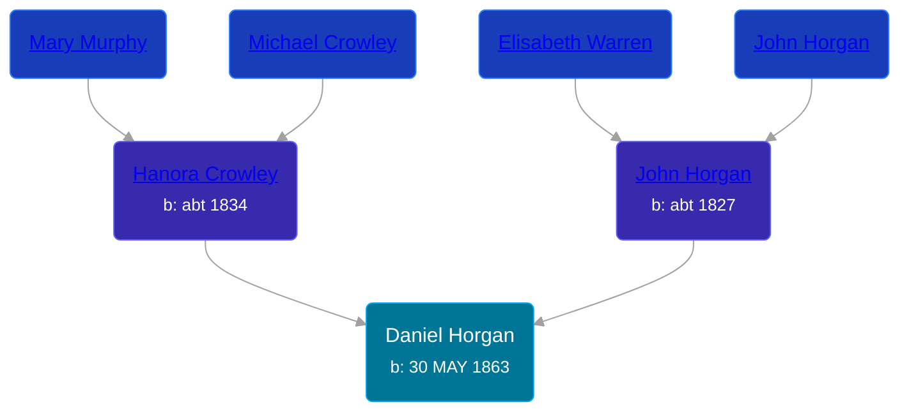

## 🔵 Daniel Horgan
<small>Age: 69y, 6m, 28d</small>

Son of [John Horgan](/people/5/54161773) and [Hanora Crowley](/people/7/72193795)





### 📆 Events


Type | Date | Age at Event | Place
------ | ------ | ------ | ------
Birth | 30 MAY 1863 |  | Stratford, Ontario, Canada
[Residence](#event-event-0) | 1871 | 7y, 6m | Perth, Ontario, Canada
[Death](#event-event-4) | 28 DEC 1932 | 69y, 6m, 28d | Carrollton, Saginaw, Michigan, USA



- **Birth**
**Date**: 30 MAY 1863, Age:
**Place**: Stratford, Ontario, Canada
- **[Residence](#event-event-0)**
**Date**: 1871, Age: 7y, 6m
**Place**: Perth, Ontario, Canada
- **[Death](#event-event-4)**
**Date**: 28 DEC 1932, Age: 69y, 6m, 28d
**Place**: Carrollton, Saginaw, Michigan, USA


## 👩‍❤️‍👨 Relationships

### 🟣 [Living Person](/people/7/71033808)

### 📰 Event Sources

####  Residence, 1871
* 1871 Canada Census
>   
  > Name: Daniel Horgan  
  > Sex: Male  
  > Age: 9 years  
  > Birth Date: 1862  
  > Birthplace: O  
  > Nationality: Irish  
  > Religion: Catholic  
  > Event Type: Census  
  > Event Date: 1871  
  > Event Place: Perth, Ontario, Canada  
  > Sub-District: Ellice  
  > Household Identifier: 1  
  > House Number: 1  
  > Line Number: 3  
  > Page Number: 1  
  >   
  > Household members:  
  > - John Horgan, M, 44  
  > - Hanorah Horgan, F, 37  
  > - John Horgan, M, 15  
  > - Mary Ann Horgan, F, 13  
  > - Ellan Horgan, F, 11  
  > - Daniel Horgan, M, 9  
  > - Cornalious Horgan, M, 7  
  > - Margret Horgan, F, 5  
  > - Bridgett Horgan, F, 3  
  >

####  Death, 28 DEC 1932
* Michigan, Death Records, 1867-1950
>   
  > Name: Daniel Horgan  
  > Gender: Male  
  > Race: White  
  > Marital Status: Married  
  > Death Age: 69  
  > Birth Date: 30 May 1863  
  > Birth Place: Stratrora Ont  
  > Death Date: 28 Dec 1932  
  > Death Place: Carrollton, Saginaw, Michigan, USA  
  > File Number: 004497  
  > Father: John Horgan  
  > Mother: Hanorah Crowley
