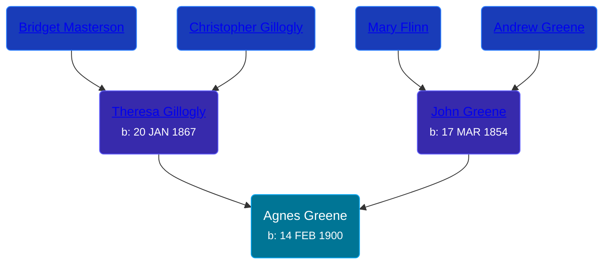

## 🟣 Agnes Greene
<small>Age: 28y, 11m, 5d</small>

Daughter of [John Greene](/people/7/71088434) and [Theresa Gillogly](/people/6/67581747)





### 📆 Events


Type | Date | Age at Event | Place
------ | ------ | ------ | ------
[Birth](#event-event-3) | 14 FEB 1900 |  | Sciota, Shiawassee, Michigan, USA
[Residence](#event-event-0) | 21 JUN 1900 | 4m, 7d | Sciota, Shiawassee, Michigan, USA
[Residence](#event-event-1) | 21 APR 1910 | 10y, 2m, 7d | Owosso, Shiawassee, Michigan, USA
[Residence](#event-event-2) | 17 JAN 1920 | 19y, 11m, 3d | Owosso, Shiawassee, Michigan, USA
[Residence](#event-event-3) | 11 APR 1950 | 50y, 1m, 27d | Owosso, Shiawassee, Michigan, USA
[Death](#event-event-8) | 19 JAN 1929 | 28y, 11m, 5d | Owosso, Shiawassee, Michigan, USA



- **[Birth](#event-event-3)**
**Date**: 14 FEB 1900, Age:
**Place**: Sciota, Shiawassee, Michigan, USA
- **[Residence](#event-event-0)**
**Date**: 21 JUN 1900, Age: 4m, 7d
**Place**: Sciota, Shiawassee, Michigan, USA
- **[Residence](#event-event-1)**
**Date**: 21 APR 1910, Age: 10y, 2m, 7d
**Place**: Owosso, Shiawassee, Michigan, USA
- **[Residence](#event-event-2)**
**Date**: 17 JAN 1920, Age: 19y, 11m, 3d
**Place**: Owosso, Shiawassee, Michigan, USA
- **[Residence](#event-event-3)**
**Date**: 11 APR 1950, Age: 50y, 1m, 27d
**Place**: Owosso, Shiawassee, Michigan, USA
- **[Death](#event-event-8)**
**Date**: 19 JAN 1929, Age: 28y, 11m, 5d
**Place**: Owosso, Shiawassee, Michigan, USA


## 👩‍❤️‍👨 Relationships

### 🔵 [Daniel Edward Mahoney](/people/2/24117676), b. 19 SEP 1887

#### Events


Type | Date | Age at Event | Place
------ | ------ | ------ | ------
[Marriage](#event-family-0-event-0) | 24 APR 1929 | 29y, 2m, 10d | Owosso, Shiawassee, Michigan, USA



- **[Marriage](#event-family-0-event-0)**
**Date**: 24 APR 1929, Age: 29y, 2m, 10d
**Place**: Owosso, Shiawassee, Michigan, USA


#### Children With Daniel Edward Mahoney
* 🔵 [Gerald E Mahoney](/people/1/10062624), b. 20 NOV 1930
* 🔵 [Philip J Mahoney](/people/6/64895326), b. 03 JUN 1932
* 🔵 [Thomas Andrew Mahoney](/people/3/30323065), b. abt 1934
### 📰 Event Sources

####  Birth, 14 FEB 1900
* Michigan, U.S., Birth Records, 1867-1914
>   
  > Name: Agnes Green    
  > Gender: Female    
  > Race: White    
  > Birth Date: 14 Feb 1900    
  > Birth Place: Sciota, Michigan, USA    
  > Father: John Green    
  > Mother: Theresa Green    
  > Jurisdiction Number: 6857    
  > Reference Number: 144    
  >

####  Residence, 21 JUN 1900
* 1900 US Census
>   
  > Name: Agnes Green  
  > Age: 3/12  
  > Birth Date: Feb 1900  
  > Birthplace: Michigan, USA  
  > Home in 1900: Sciota, Shiawassee, Michigan  
  > Sheet Number: 14  
  > Number of Dwelling in Order of Visitation: 356  
  > Family Number: 364  
  > Race: White  
  > Gender: Female  
  > Relation to Head of House: Daughter  
  > Marital Status: Single  
  > Father's Name: John Green  
  > Father's Birthplace: Canada English  
  > Mother's Name: Theresa Green  
  > Mother's Birthplace: Canada, England  
  > Naturalization: Yes  
  >   
  > Household members:  
  > - John Green, 46, Head  
  > - Theresa Green, 33, Wife  
  > - Andrew Green, 8, Son  
  > - Leona Green, 4, Daughter  
  > - Lallie Green, 2, Daughter  
  > - Agnes Green, 3/12, Daughter  
  >

####  Residence, 21 APR 1910
* 1910 US Census
>   
  > Name: Agnes Green  
  > Age in 1910: 10  
  > Birth Date: 1900  
  > Birthplace: Michigan  
  > Home in 1910: Owosso Ward 5, Shiawassee, Michigan, USA  
  > Sheet Number: 10b  
  > Street: Mack  
  > Race: White  
  > Gender: Female  
  > Relation to Head of House: Daughter  
  > Marital Status: Single  
  > Father's Birthplace: Canada  
  > Mother's Birthplace: Canada  
  > Native Tongue: English  
  > Attended School: Y  
  > Able to read: Y  
  > Able to Write: Y  
  > Enumeration District Number: 0093  
  > Enumerated Year: 1910  
  >   
  > Household members:  
  > - John Green, 65, Head    
  > - Theresa Green, 42, Wife    
  > - Andrew Green, 18, Son    
  > - Leona Green, 14, Daughter    
  > - Theresa Green, 12, Daughter    
  > - Agnes Green, 10, Daughter    
  > - Aldon Green, 8, Son    
  > - Helen Green, 2, Daughter    
  >

####  Residence, 17 JAN 1920
* 1920 US Census
>   
  > Name: Agnes Green  
  > Age: 19  
  > Birth Year: abt 1901  
  > Birthplace: Michigan  
  > Home in 1920: Owosso Ward 5, Shiawassee, Michigan  
  > Street: Wack Street  
  > Residence Date: 1920  
  > Race: White  
  > Gender: Female  
  > Relation to Head of House: Daughter  
  > Marital Status: Single  
  > Father's Birthplace: Canada  
  > Mother's Birthplace: Canada  
  > Able to Speak English: Yes  
  > Occupation: Wholesale Buyer  
  > Industry: Auto Body Work  
  > Employment Field: Wage or Salary  
  > Attended School: No  
  > Able to read: Yes  
  > Able to Write: Yes  
  >   
  > Household members:  
  > - Theresa Green, 57, Head  
  > - Andy Green, 28, Son  
  > - Agnes Green, 19, Daughter  
  > - Eldred Green, 17, Son  
  > - Helen Green, 11, Daughter  
  > - Fred Metzgar, 24, Son-in-law  
  > - Theresa Metzgar, 22, Daughter  
  > - John Metzgar, 1, Grandson  
  >

####  Death, 19 JAN 1929
* Michigan, Death Records, 1867-1950

####  Marriage, 24 APR 1929
* Michigan, Marriage Records, 1867-1952
>   
  > Name: Agnes Greene  
  > Gender: Female  
  > Race: White  
  > Age: 29  
  > Birth Date: abt 1900  
  > Birth Place: Laingsburg, Michigan  
  > Marriage License Place: Shiawassee  
  > Marriage Date: 24 Apr 1929  
  > Marriage Place: Owosso, Shiawassee, Michigan, USA  
  > Residence Place: Owosso, Michigan  
  > Father: John Greene  
  > Mother: Theresa Gillogly  
  > Spouse: Daniel E Mahoney  
  > Gender: Male  
  > Race: White  
  > Age: 38  
  > Birth Date: abt 1891  
  > Birth Place: St Charles, Michigan  
  > Father: Thomas Mahoney  
  > Mother: Mary Ann Morgan  
  > County File Number: 899  
  > State File Number: 76 1167  
  >
####  Residence, 11 APR 1950
* 1950 US Census
>   
  > Name: Agnes Manoney  
  > Age: 50  
  > Birth Date: abt 1900  
  > Gender: Female  
  > Race: White  
  > Birth Place: Michigan  
  > Marital Status: Married  
  > Relation to Head of House: Wife  
  > Residence Date: 1950  
  > Home in 1950: Owosso, Shiawassee, Michigan, USA  
  > Street Name: Howell  
  > House Number: 206  
  > Dwelling Number: 192  
  > Farm: No  
  > Occupation Category: Keeping House  
  > Worked Last Week: No  
  > Seeking Work: No  
  > Employment Status: No  
  >   
  > Household members:  
  > D. Edward Mahoney, 62, Head  
  > Agnes Mahoney, 50, Wife  
  > Gerald F Mahoney, 19, Son  
  > Philip J Mahoney, 17, Son  
  > Thomas A Mahoney, 16, Son  
  >
