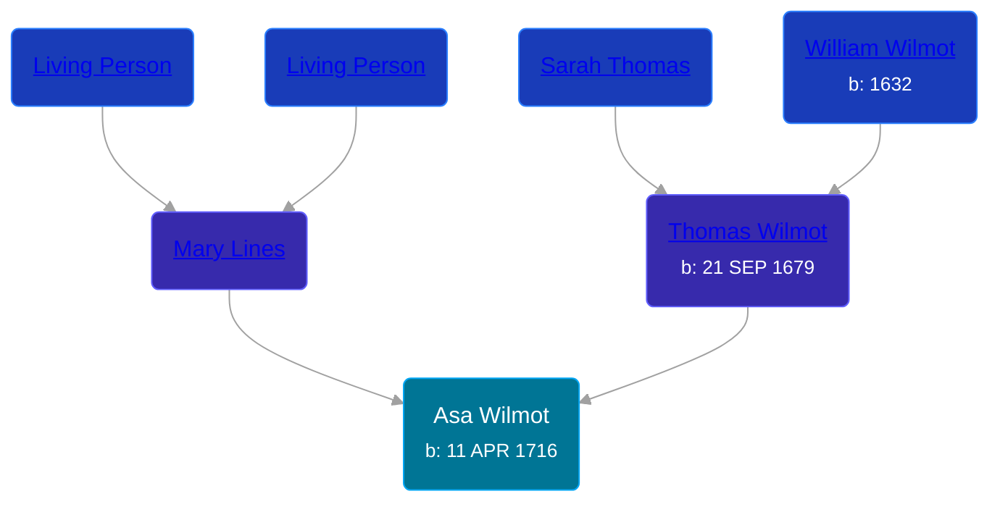

## 🔵 Asa Wilmot
<small>Age: 58y, 2m, 11d</small>

Son of [Thomas Wilmot](/people/3/36930663) and [Mary Lines](/people/1/19292651)





### 📆 Events


Type | Date | Age at Event | Place
------ | ------ | ------ | ------
[Birth](#event-event-2) | 11 APR 1716 |  | New Haven, New Haven, Connecticut, USA
[Death](#event-event-3) | 22 JUN 1774 | 58y, 2m, 11d | Cheshire, New Haven, Connecticut



- **[Birth](#event-event-2)**
**Date**: 11 APR 1716, Age:
**Place**: New Haven, New Haven, Connecticut, USA
- **[Death](#event-event-3)**
**Date**: 22 JUN 1774, Age: 58y, 2m, 11d
**Place**: Cheshire, New Haven, Connecticut


## 👩‍❤️‍👨 Relationships

### 🟣 [Sarah Johson](/people/4/48968878), b. 01 NOV 1716

#### Events


Type | Date | Age at Event | Place
------ | ------ | ------ | ------
[Marriage](#event-family-0-event-0) | 1740 | 23y, 7m, 19d |



- **[Marriage](#event-family-0-event-0)**
**Date**: 1740, Age: 23y, 7m, 19d
**Place**:


#### Children With Sarah Johson
* 🔵 [Elijah Wilmot](/people/9/99050066), b. 17 DEC 1742
* 🟣 [Sarah Wilmot](/people/3/33582066), b. 10 APR 1745
* 🔵 [Asa Wilmot](/people/4/47117298), b. ABT 1748
* 🔵 [Thomas Wilmot](/people/4/47695656), b. 06 JAN 1750
* 🔵 [Asa Wilmot](/people/9/91393496), b. 06 AUG 1752
* 🔵 [Amos Wilmot](/people/3/34677049), b. 29 FEB 1756
* 🔵 [Joel Wilmot](/people/1/17310990), b. 08 MAR 1759
* 🔵 [Elisha Wilmot](/people/2/21177328), b. 12 MAR 1763
### 📰 Event Sources

####  Birth, 11 APR 1716
* The New England Historical and Genealogical Register  - 71
* Historical Catalogue of the Members of the First Church of Christ in New Haven, Connecticut  - 82

####  Marriage, 1740
* The New England Historical and Genealogical Register  - 73
####  Death, 22 JUN 1774
* Historical Catalogue of the Members of the First Church of Christ in New Haven, Connecticut  - 82
