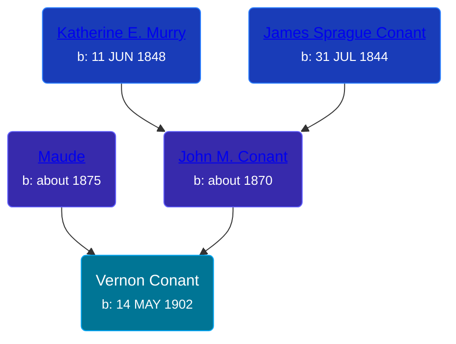

## 🔵 Vernon Conant
<small>Age: 83y, 9m, 28d</small>

Son of [John M. Conant](/people/3/38989658) and [Maude ](/people/5/58402932)





### 📆 Events


Type | Date | Age at Event | Place
------ | ------ | ------ | ------
Birth | 14 MAY 1902 |  | Michigan, USA
[Residence](#event-event-0) | 1910 | 7y, 6m, 16d | Robinson Township, Ottawa, Michigan, USA
[Residence](#event-event-1) | 1920 | 17y, 6m, 16d | Grand Haven, Ottawa, Michigan, USA
[Death](#event-event-5) | 12 MAR 1986 | 83y, 9m, 28d | Michigan, USA



- **Birth**
**Date**: 14 MAY 1902, Age:
**Place**: Michigan, USA
- **[Residence](#event-event-0)**
**Date**: 1910, Age: 7y, 6m, 16d
**Place**: Robinson Township, Ottawa, Michigan, USA
- **[Residence](#event-event-1)**
**Date**: 1920, Age: 17y, 6m, 16d
**Place**: Grand Haven, Ottawa, Michigan, USA
- **[Death](#event-event-5)**
**Date**: 12 MAR 1986, Age: 83y, 9m, 28d
**Place**: Michigan, USA


## 👩‍❤️‍👨 Relationships

### ⚪ Unknown Person

#### Children With Unknown Person
* 🔵 [Living Person](/people/9/98925772)
### 📰 Event Sources

####  Residence, 1910
* 1910 US Census

####  Residence, 1920
* 1920 US Census

####  Death, 12 MAR 1986
* The Grand Rapids Press
>   
  > CONANT -- Vernon C. Conant, aged 83, of 613 Sheldon Rd., Grand Haven, passed away Wednesday at a local nursing home. He worked for the Ottawa County Sheriff Department retiring in 1968 as a Jail Sargeant. Surviving are his daughter, Mrs. Harold R. (Betty) Hansen of Spring Lake; his grand-daughter, Mrs. Robert (Cathie) Porath of Grand Haven; two great-grand-children. The Funeral SErvice will be held Saturday 11am from VanZantwick-Bartels-Kammeraad Funeral Home, Grand Haven. Visitation 2 to 4 and 7 to 9 Friday. Those desiring a memorial are asked to consider the First Presbyterian Church Building Fund.
* U.S., Social Security Death Index, 1935-2014
>   
  > Name: Vernon Conant  
  > Birth: 14 May 1902  
  > Death: Mar 1986  
  > Last Residence: 49417 (Grand Haven, Ottawa, MI)  
  > Last Benefit: (none specified)  
  > SSN: ###-##-####  
  > Issued: Michigan
