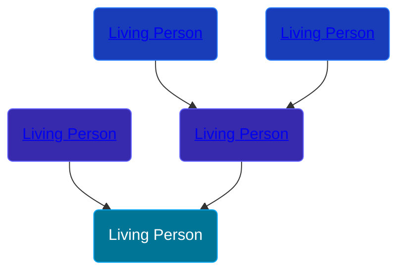

## 🔵 Living Person

Son of [Living Person](/people/2/21284059) and [Living Person](/people/7/72063628)



```mermaid
graph
classDef grands fill:#193cb8,stroke:#2b7fff,stroke-width:1px,color:#fff;
classDef parents fill:#372aac,stroke:#615fff,stroke-width:1px,color:#fff;
classDef primary fill:#007595,stroke:#00a6f4,stroke-width:1px,color:#fff;
16620202(Living Person):::primary
72063628(<a class="text-white" href="/people/7/72063628">Living Person</a>):::parents-->16620202
21284059(<a class="text-white" href="/people/2/21284059">Living Person</a>):::parents-->16620202
27090454(<a class="text-white" href="/people/2/27090454">Living Person</a>):::grands-->21284059
28832046(<a class="text-white" href="/people/2/28832046">Living Person</a>):::grands-->21284059
```

