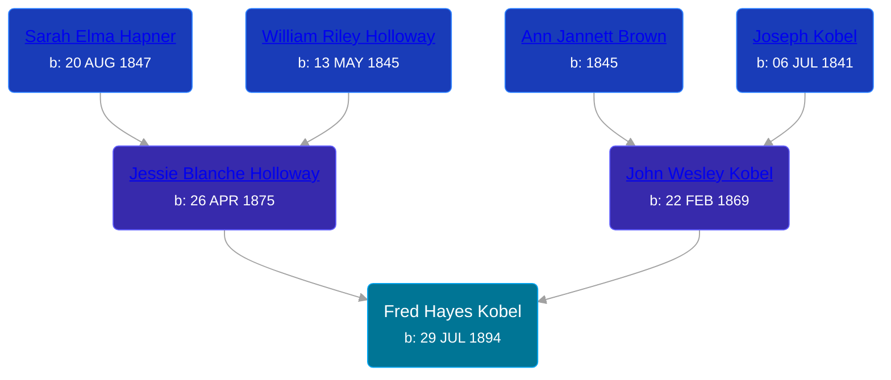

## 🔵 Fred Hayes Kobel
<small>Age: 34y, 10m, 5d</small>

Son of [John Wesley Kobel](/people/2/24649136) and [Jessie Blanche Holloway](/people/2/29242864)





### 📆 Events


Type | Date | Age at Event | Place
------ | ------ | ------ | ------
[Birth](#event-event-2) | 29 JUL 1894 |  | Elmira Township, Antrim, Michigan, USA
[Residence](#event-event-0) | 01 JUN 1900 | 5y, 10m, 2d | Warner Township, Antrim, Michigan, USA
[Residence](#event-event-1) | 15 APR 1910 | 15y, 8m, 16d | Warner Township, Antrim, Michigan, USA
Death | 04 JUN 1929 | 34y, 10m, 5d | Elmira Township, Antrim, Michigan, USA
[Burial](#event-event-6) |  |  | Maple Hill Cemetery, Elmira Township, Antrim, Michigan, USA



- **[Birth](#event-event-2)**
**Date**: 29 JUL 1894, Age:
**Place**: Elmira Township, Antrim, Michigan, USA
- **[Residence](#event-event-0)**
**Date**: 01 JUN 1900, Age: 5y, 10m, 2d
**Place**: Warner Township, Antrim, Michigan, USA
- **[Residence](#event-event-1)**
**Date**: 15 APR 1910, Age: 15y, 8m, 16d
**Place**: Warner Township, Antrim, Michigan, USA
- **Death**
**Date**: 04 JUN 1929, Age: 34y, 10m, 5d
**Place**: Elmira Township, Antrim, Michigan, USA
- **[Burial](#event-event-6)**
**Date**:
**Place**: Maple Hill Cemetery, Elmira Township, Antrim, Michigan, USA


## 👩‍❤️‍👨 Relationships

### 🟣 [Hattie Irene Weldfong](/people/5/59131944), b. Oct 1895

#### Children With Hattie Irene Weldfong
* 🔵 [Ralph Hayes Kobel](/people/7/77168350), b. 03 APR 1917
* 🔵 [Fred Willis Kobel](/people/5/51851068), b. 31 MAY 1921
* 🔵 [Harold LeRoy Kobel](/people/6/65495296), b. 08 JUL 1925
### 📰 Event Sources

####  Birth, 29 JUL 1894
* U.S., World War I Draft Registration Cards, 1917-1918  - Roll: 1675114

####  Residence, 01 JUN 1900
* 1900 US Census

####  Residence, 15 APR 1910
* 1910 US Census

####  Burial
* findagrave.com
