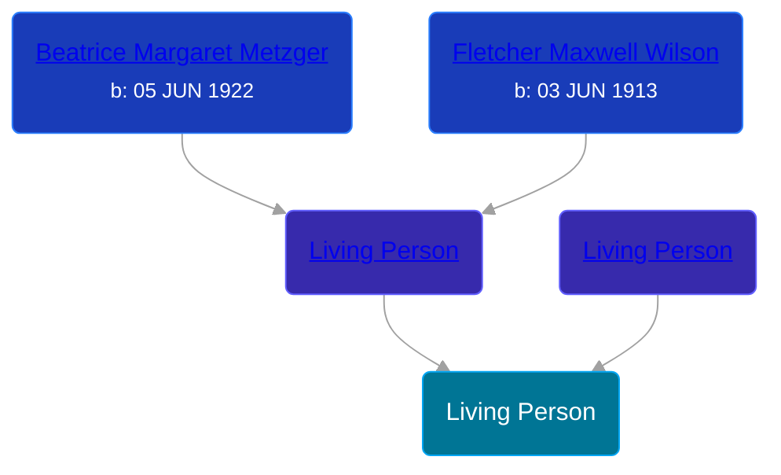

## 🟣 Living Person

Daughter of [Living Person](/people/8/84637541) and [Living Person](/people/9/91180844)



```mermaid
graph
classDef grands fill:#193cb8,stroke:#2b7fff,stroke-width:1px,color:#fff;
classDef parents fill:#372aac,stroke:#615fff,stroke-width:1px,color:#fff;
classDef primary fill:#007595,stroke:#00a6f4,stroke-width:1px,color:#fff;
17102831(Living Person):::primary
91180844(<a class="text-white" href="/people/9/91180844">Living Person</a>):::parents-->17102831
79763948(<a class="text-white" href="/people/7/79763948">Beatrice Margaret Metzger</a><br /><small>b: 05 JUN 1922</small>):::grands-->91180844
32597724(<a class="text-white" href="/people/3/32597724">Fletcher Maxwell Wilson</a><br /><small>b: 03 JUN 1913</small>):::grands-->91180844
84637541(<a class="text-white" href="/people/8/84637541">Living Person</a>):::parents-->17102831
linkStyle default stroke:#a1a1a1
```


## 👩â€â¤ï¸â€ğŸ‘¨ Relationships

### 🔵 [Living Person](/people/1/17724273)
