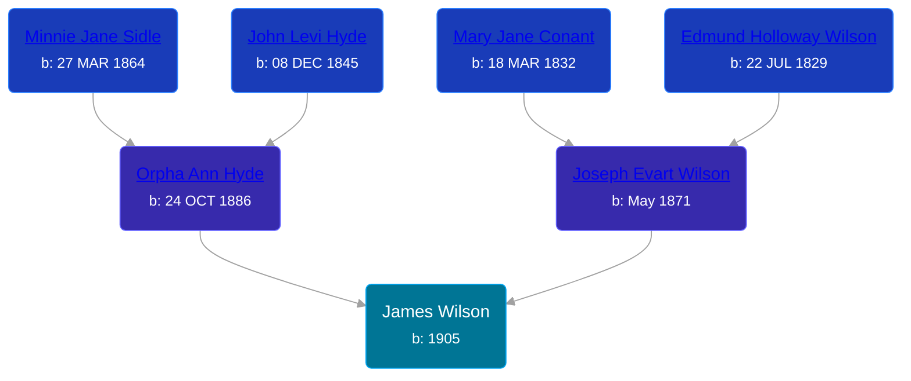

## 🔵 James Wilson
<small>Age: 11m, 5d</small>

Son of [Joseph Evart Wilson](/people/5/57306025) and [Orpha Ann Hyde](/people/6/63932813)





### 📆 Events


Type | Date | Age at Event | Place
------ | ------ | ------ | ------
Birth | 1905 |  | Michigan, USA
[Death](#event-event-3) | 05 NOV 1905 | 11m, 5d | Tyrone Township, Kent, Michigan, USA



- **Birth**
**Date**: 1905, Age:
**Place**: Michigan, USA
- **[Death](#event-event-3)**
**Date**: 05 NOV 1905, Age: 11m, 5d
**Place**: Tyrone Township, Kent, Michigan, USA


## 📝 Notes
>   
  > James and Philip Wilson may be the same person
### 📰 Event Sources

####  Death, 05 NOV 1905
* Michigan Deaths, 1971-1996
>   
  > Name: James Wilson  
  > Gender: Male  
  > Age: 0  
  > Race: White  
  > Birth Year: 1905  
  > Death Date:5 Nov 1905  
  > Death Place: Tyrone, Kent, Michigan, USA  
  > Father: Joseph Wilson  
  > Mother: Orpha Wilson
