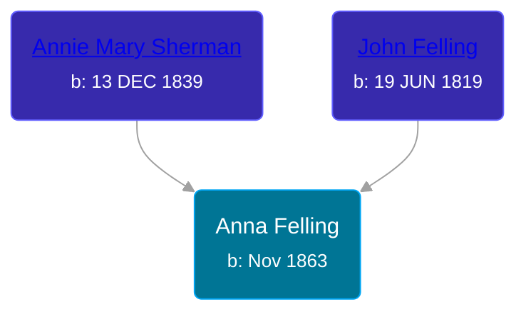

## 🟣 Anna Felling
<small>Age: 54y, 2m, 16d</small>

Daughter of [John Felling](/people/8/83711573) and [Annie Mary Sherman](/people/3/35774638)





### 📆 Events


Type | Date | Age at Event | Place
------ | ------ | ------ | ------
Birth | Nov 1863 |  | Minnesota, USA
[Residence](#event-event-0) | 12 JUN 1895 | 31y, 7m, 12d | St Paul, Ramsey, Minnesota, USA
[Residence](#event-event-1) | 06 JUN 1900 | 36y, 7m, 6d | St Paul, Ramsey, Minnesota, USA
[Residence](#event-event-2) | 13 JAN 1920 | 56y, 2m, 13d | St Paul, Ramsey, Minnesota, USA
[Death](#event-event-7) | 16 JAN 1918 | 54y, 2m, 16d | Nicolette, Minnesota, USA
[Burial](#event-event-8) |  |  | Calvary Cemetery, St Paul, Ramsey, Minnesota, USA



- **Birth**
**Date**: Nov 1863, Age:
**Place**: Minnesota, USA
- **[Residence](#event-event-0)**
**Date**: 12 JUN 1895, Age: 31y, 7m, 12d
**Place**: St Paul, Ramsey, Minnesota, USA
- **[Residence](#event-event-1)**
**Date**: 06 JUN 1900, Age: 36y, 7m, 6d
**Place**: St Paul, Ramsey, Minnesota, USA
- **[Residence](#event-event-2)**
**Date**: 13 JAN 1920, Age: 56y, 2m, 13d
**Place**: St Paul, Ramsey, Minnesota, USA
- **[Death](#event-event-7)**
**Date**: 16 JAN 1918, Age: 54y, 2m, 16d
**Place**: Nicolette, Minnesota, USA
- **[Burial](#event-event-8)**
**Date**:
**Place**: Calvary Cemetery, St Paul, Ramsey, Minnesota, USA


## 👩‍❤️‍👨 Relationships

### 🔵 [Frank Nolz](/people/6/61628928), b. Nov 1857

#### Children With Frank Nolz
* 🟣 [Annie M. Nolz](/people/9/95147455), b. Jul 1885
* 🟣 [Theresa R. Nolz](/people/5/50924540), b. Sep 1886
* 🟣 [Magdalena Nolz](/people/7/73853224), b. May 1890
* 🟣 [Elizabeth Nolz](/people/3/37387446), b. 12 OCT 1892
* 🔵 [Andrew Frank Nolz](/people/2/26908800), b. 02 JUL 1895
* 🔵 [Frank L. Nolz](/people/9/95132139), b. Dec 1897
* 🟣 [Lucille Marie Nolz](/people/5/51370797), b. 23 JUN 1900
### 📰 Event Sources

####  Residence, 12 JUN 1895
* 1895 Minnesota State Census

####  Residence, 06 JUN 1900
* 1900 US Census

####  Death, 16 JAN 1918
* Minnesota, Death Index, 1908-2002

####  Residence, 13 JAN 1920
* 1920 US Census

####  Burial
* findagrave.com
>   
  > https://www.findagrave.com/memorial/113768969/frank-nolz  
  >   
  > Anna Nolz  
  > 1863-1918
