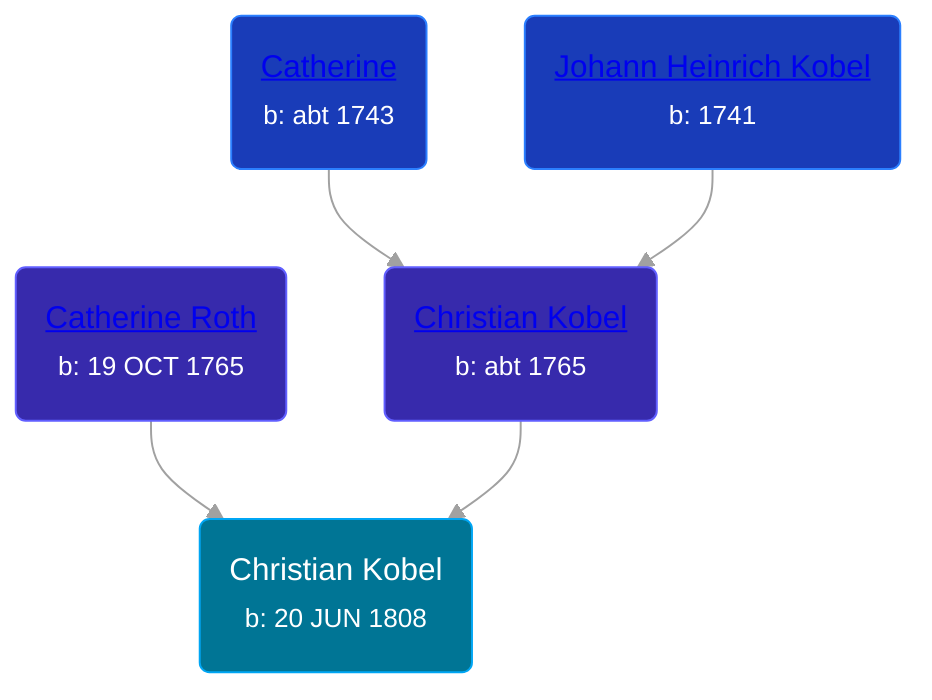

## 🔵 Christian Kobel
<small>Age: 80y, 1m, 3d</small>

Son of [Christian Kobel](/people/6/64236632) and [Catherine Roth](/people/8/85792165)





### 📆 Events


Type | Date | Age at Event | Place
------ | ------ | ------ | ------
[Birth](#event-event-2) | 20 JUN 1808 |  | Huntingdon, Pennsylvania, USA
[Residence](#event-event-0) | 18 SEP 1850 | 42y, 2m, 28d | Superior, Williams, Ohio, USA
[Residence](#event-event-1) | 10 JUL 1860 | 52y, 20d | Superior, Williams, Ohio, USA
[Residence](#event-event-2) | 30 JUN 1870 | 62y, 10d | Union Township, Isabella, Michigan, USA
[Residence](#event-event-3) | 16 JUN 1880 | 71y, 11m, 26d | Union Township, Isabella, Michigan, USA
[Death](#event-event-7) | 23 JUL 1888 | 80y, 1m, 3d | Chase, Lake, Michigan, USA



- **[Birth](#event-event-2)**
**Date**: 20 JUN 1808, Age:
**Place**: Huntingdon, Pennsylvania, USA
- **[Residence](#event-event-0)**
**Date**: 18 SEP 1850, Age: 42y, 2m, 28d
**Place**: Superior, Williams, Ohio, USA
- **[Residence](#event-event-1)**
**Date**: 10 JUL 1860, Age: 52y, 20d
**Place**: Superior, Williams, Ohio, USA
- **[Residence](#event-event-2)**
**Date**: 30 JUN 1870, Age: 62y, 10d
**Place**: Union Township, Isabella, Michigan, USA
- **[Residence](#event-event-3)**
**Date**: 16 JUN 1880, Age: 71y, 11m, 26d
**Place**: Union Township, Isabella, Michigan, USA
- **[Death](#event-event-7)**
**Date**: 23 JUL 1888, Age: 80y, 1m, 3d
**Place**: Chase, Lake, Michigan, USA


## 👩‍❤️‍👨 Relationships

### 🟣 [Magdalena Sophia Henninger](/people/6/64241610), b. 07 JAN 1811

#### Events


Type | Date | Age at Event | Place
------ | ------ | ------ | ------
[Marriage](#event-family-0-event-0) | 11 NOV 1830 | 22y, 4m, 21d | Wayne, Wayne, Ohio, USA



- **[Marriage](#event-family-0-event-0)**
**Date**: 11 NOV 1830, Age: 22y, 4m, 21d
**Place**: Wayne, Wayne, Ohio, USA


#### Children With Magdalena Sophia Henninger
* 🟣 [Sarah Ann Kobel](/people/4/45477428), b. 28 MAY 1832
* 🔵 [Kobel](/people/2/22427094), b. 12 FEB 1834
* 🔵 [Henry Kobel](/people/8/84112000), b. 19 MAR 1835
* 🔵 [Hyram Kobel](/people/3/34505322), b. 25 JAN 1838
* 🔵 [Joseph Kobel](/people/4/44694656), b. 06 JUL 1841
* 🟣 [Catherine Kobel](/people/7/73520945), b. 1843
* 🔵 [Charles Kobel](/people/1/10022372), b. abt 1843
### 🟣 [Sarah Wolf](/people/9/98742372), b. about 1823

#### Events


Type | Date | Age at Event | Place
------ | ------ | ------ | ------
[Marriage](#event-family-1-event-0) | 18 APR 1847 | 38y, 9m, 28d | Williams, Ohio, USA



- **[Marriage](#event-family-1-event-0)**
**Date**: 18 APR 1847, Age: 38y, 9m, 28d
**Place**: Williams, Ohio, USA


#### Children With Sarah Wolf
* 🔵 [Charles Kobel](/people/8/82937830), b. about 1865
### 📰 Event Sources

####  Birth, 20 JUN 1808
* Ron Wilson's Research

####  Marriage, 11 NOV 1830
* Ohio, County Marriages, 1774-1993
>   
  > Name: Magdelena Heninger  
  > Gender: Female  
  > Marriage Date: 11 Nov 1830  
  > Marriage Place: Wayne, Ohio, USA  
  > Spouse: Christian Koble  
  > Film Number: 000425753

####  Marriage, 18 APR 1847
* Ohio, County Marriages, 1774-1993
>   
  > Name: Christian Koble  
  > Gender: Male  
  > Marriage Date: 18 Apr 1847  
  > Marriage Place: Williams, Ohio, USA  
  > Spouse: Sarah Wolf  
  > Film Number: 000914036

####  Residence, 18 SEP 1850
* 1850 US Census
>   
  > Name: Christian Koble  
  > Gender: Male  
  > Race: White  
  > Age: 37  
  > Birth Year: abt 1813  
  > Birthplace: Pennsylvania  
  > Home in 1850: Superior, Williams, Ohio, USA  
  > Occupation: Carpenter  
  > Industry: Construction  
  > Line Number: 14  
  > Dwelling Number: 546  
  > Family Number: 548  
  > Inferred Spouse:   
  > Sarah Koble  
  > Inferred Child:   
  > Joseph Koble  
  > Levi Koble

####  Residence, 10 JUL 1860
* 1860 US Census
>   
  > Name: Christian Kobel  
  > Age: 51  
  > Birth Year: abt 1809  
  > Gender: Male  
  > Race: White  
  > Birth Place: Pennsylvania  
  > Home in 1860: Superior, Williams, Ohio  
  > Post Office: Montpelier  
  > Dwelling Number: 934  
  > Family Number: 902  
  > Occupation: Carpenter  
  > Real Estate Value: 250  
  > Personal Estate Value: 500  
  > Inferred Spouse:   
  > Sarah Kobel  
  > Inferred Child:   
  > Levi Kobel  
  > Francis Kobel  
  > Mary Kobel

####  Residence, 30 JUN 1870
* 1870 US Census
>   
  > Name: Christian Kobel  
  > Age in 1870: 61  
  > Birth Date: abt 1809  
  > Birthplace: Pennsylvania  
  > Dwelling Number: 87  
  > Home in 1870: Union, Isabella, Michigan  
  > Race: White  
  > Gender: Male  
  > Post Office: Mount Pleasant  
  > Occupation: Farmer  
  > Male Citizen Over 21: Yes  
  > Personal Estate Value: 250  
  > Real Estate Value: 1000  
  > Inferred Children: Sarah Kobel; Mary E Kobel; John E Kobel; Charles Kobel; George Kobel
####  Residence, 16 JUN 1880
* 1880 US Census
>   
  > Name: Christian Koble  
  > Age: 72  
  > Birth Date: Abt 1808  
  > Birthplace: Pennsylvania  
  > Home in 1880: Union, Isabella, Michigan, USA  
  > Dwelling Number: 169  
  > Race: White  
  > Gender: Male  
  > Relation to Head of House: Self (Head)  
  > Marital Status: Widower  
  > Father's Birthplace: Pennsylvania  
  > Mother's Birthplace: Pennsylvania  
  > Occupation: Laborer

####  Death, 23 JUL 1888
* Ron Wilson's Research
