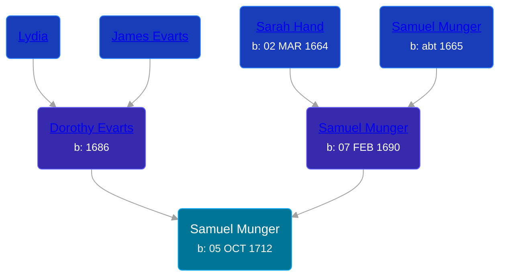

## 🔵 Samuel Munger
<small>Age: 86y, 10m, 6d</small>

Son of [Samuel Munger](/people/6/64239804) and [Dorothy Evarts](/people/5/59501816)





### 📆 Events


Type | Date | Age at Event | Place
------ | ------ | ------ | ------
[Birth](#event-event-2) | 05 OCT 1712 |  | Guilford, Connecticut, USA
[Death](#event-event-3) | 11 AUG 1799 | 86y, 10m, 6d | Brimfield, Massachusetts, USA



- **[Birth](#event-event-2)**
**Date**: 05 OCT 1712, Age:
**Place**: Guilford, Connecticut, USA
- **[Death](#event-event-3)**
**Date**: 11 AUG 1799, Age: 86y, 10m, 6d
**Place**: Brimfield, Massachusetts, USA


## 👩‍❤️‍👨 Relationships

### 🟣 [Abigail Barstow](/people/9/9488484), b. 19 MAY 1723

#### Events


Type | Date | Age at Event | Place
------ | ------ | ------ | ------
[Marriage](#event-family-0-event-0) | 14 MAR 1745 | 32y, 5m, 9d | Woodstock, Windham, Connecticut, USA



- **[Marriage](#event-family-0-event-0)**
**Date**: 14 MAR 1745, Age: 32y, 5m, 9d
**Place**: Woodstock, Windham, Connecticut, USA


#### Children With Abigail Barstow
* 🟣 [Living Person](/people/2/2239106)
* 🔵 [Jerusha Munger](/people/8/85922584), b. 29 SEP 1745
* 🔵 [Samuel Munger](/people/1/17819572), b. 14 MAY 1748
* 🔵 [Sarah Munger](/people/8/85764310), b. 08 SEP 1750
* 🔵 [Jeremiah Munger](/people/1/19410568), b. 03 MAY 1755
* 🔵 [Joseph Munger](/people/4/48832802), b. 28 DEC 1758
* 🟣 [Rhoda Munger](/people/2/23648419), b. ABT 1761
### 📰 Event Sources

####  Birth, 05 OCT 1712
* The Munger Book  - 209
* Families of Early Guilford, Connecticut, Vol. II  - 835, 837

####  Marriage, 14 MAR 1745
* Early Connecticut Marriages  - 110
####  Death, 11 AUG 1799
* The Munger Book  - 230
