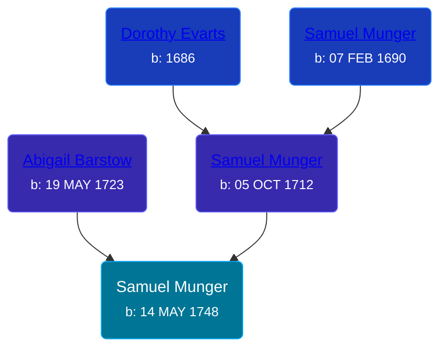

## 🔵 Samuel Munger

Son of [Samuel Munger](/people/1/17676382) and [Abigail Barstow](/people/9/9488484)





### 📆 Events


Type | Date | Age at Event | Place
------ | ------ | ------ | ------
[Birth](#event-event-2) | 14 MAY 1748 |  | Brimfield, Massachusetts, USA



- **[Birth](#event-event-2)**
**Date**: 14 MAY 1748, Age:
**Place**: Brimfield, Massachusetts, USA


### 📰 Event Sources

####  Birth, 14 MAY 1748
* The Munger Book  - 209, 228