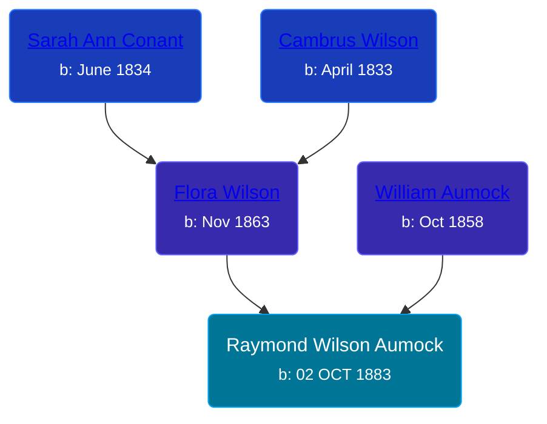

## 🔵 Raymond Wilson Aumock

Son of [William Aumock](/people/5/50418111) and [Flora Wilson](/people/2/2426620)





### 📆 Events


Type | Date | Age at Event | Place
------ | ------ | ------ | ------
[Birth](#event-event-2) | 02 OCT 1883 |  | Westbury, Nassau, New York, USa
[Residence](#event-event-0) | 16 FEB 1892 | 8y, 4m, 14d | Savannah, Wayne, New York, USA
[Residence](#event-event-1) | 04 JUN 1900 | 16y, 8m, 2d | Wolcott, Wayne, New York, USA
[Residence](#event-event-2) | January 1920 | 36y, 2m, 28d | Detroit, Wayne, Michigan, USA
[Residence](#event-event-3) | 28 APR 1930 | 46y, 6m, 26d | Detroit, Wayne, Michigan, USA
[Residence](#event-event-4) | 12 APR 1940 | 56y, 6m, 10d | Detroit, Wayne, Michigan, USA



- **[Birth](#event-event-2)**
**Date**: 02 OCT 1883, Age:
**Place**: Westbury, Nassau, New York, USa
- **[Residence](#event-event-0)**
**Date**: 16 FEB 1892, Age: 8y, 4m, 14d
**Place**: Savannah, Wayne, New York, USA
- **[Residence](#event-event-1)**
**Date**: 04 JUN 1900, Age: 16y, 8m, 2d
**Place**: Wolcott, Wayne, New York, USA
- **[Residence](#event-event-2)**
**Date**: January 1920, Age: 36y, 2m, 28d
**Place**: Detroit, Wayne, Michigan, USA
- **[Residence](#event-event-3)**
**Date**: 28 APR 1930, Age: 46y, 6m, 26d
**Place**: Detroit, Wayne, Michigan, USA
- **[Residence](#event-event-4)**
**Date**: 12 APR 1940, Age: 56y, 6m, 10d
**Place**: Detroit, Wayne, Michigan, USA


## 👩‍❤️‍👨 Relationships

### 🟣 [Helen Ritchie](/people/8/88758866), b. about 1904

#### Events


Type | Date | Age at Event | Place
------ | ------ | ------ | ------
[Marriage](#event-family-0-event-0) | 17 DEC 1924 | 41y, 2m, 15d | Detroit, Wayne, Michigan, USA



- **[Marriage](#event-family-0-event-0)**
**Date**: 17 DEC 1924, Age: 41y, 2m, 15d
**Place**: Detroit, Wayne, Michigan, USA


#### Children With Helen Ritchie
* 🔵 [Living Person](/people/6/61349489)
* 🟣 [Living Person](/people/7/73724053)
* 🔵 [Reginald Aumock](/people/6/62743185), b. 19 DEC 1926
### 📰 Event Sources

####  Birth, 02 OCT 1883
* U.S., World War I Draft Registration Cards, 1917-1918
* U.S., World War II Draft Registration Cards, 1942

####  Residence, 16 FEB 1892
* 1892 New York Census

####  Residence, 04 JUN 1900
* 1900 US Census

####  Residence, January 1920
* 1920 US Census

####  Marriage, 17 DEC 1924
* Michigan, Marriage Records, 1867-1952

####  Residence, 28 APR 1930
* 1930 US Census
####  Residence, 12 APR 1940
* 1940 US Census
