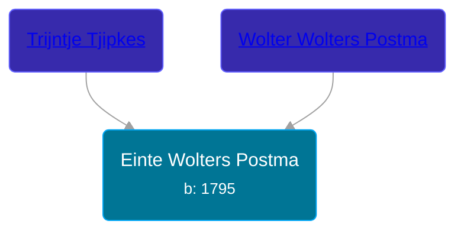

## 🔵 Einte Wolters Postma

Son of [Wolter Wolters Postma](/people/2/26527652) and [Trijntje Tjipkes](/people/7/78249927)





### 📆 Events


Type | Date | Age at Event | Place
------ | ------ | ------ | ------
[Birth](#event-event-2) | 1795 |  | Duurswoude, Netherlands



- **[Birth](#event-event-2)**
**Date**: 1795, Age:
**Place**: Duurswoude, Netherlands


## 👩‍❤️‍👨 Relationships

### 🟣 [Riekeltje Jakobs Wagenaar](/people/7/77820694), b. About 1804

#### Events


Type | Date | Age at Event | Place
------ | ------ | ------ | ------
[Marriage](#event-family-0-event-0) | 22 APR 1824 | 29y, 4m, 22d | Opsterland, Netherlands



- **[Marriage](#event-family-0-event-0)**
**Date**: 22 APR 1824, Age: 29y, 4m, 22d
**Place**: Opsterland, Netherlands


#### Children With Riekeltje Jakobs Wagenaar
* 🔵 [Wolter Eintes Postma](/people/7/78693659), b. 05 AUG 1825
* 🔵 [Jakob Eintes Postma](/people/4/46630400), b. 21 AUG 1827
* 🔵 [Tjipke Eintes Postma](/people/9/98204460), b. 03 OCT 1829
* 🔵 [Iebele Eintes Postma](/people/6/62935454), b. 21 JUL 1833
* 🔵 [Riekele Postma](/people/4/40864364), b. 17 SEP 1838
### 🟣 [Renskje Engelbartus van Dijk](/people/3/31673342), b. about 1794

#### Events


Type | Date | Age at Event | Place
------ | ------ | ------ | ------
[Marriage](#event-family-1-event-0) | 04 MAY 1839 | 44y, 5m, 4d |



- **[Marriage](#event-family-1-event-0)**
**Date**: 04 MAY 1839, Age: 44y, 5m, 4d
**Place**:


### 📰 Event Sources

####  Birth, 1795
* Dutch Civil Register
>   
  > Registered: Einte Wolters Postma  
  > Birth date: 1795  
  > Place of birth: Duurswoude  
  > Event: Registratie  
  > Event date: 1795  
  > Event place: Duurswoude  
  > Document type: Bevolkingsregister  
  > Heritage institution: AlleFriezen  
  > Institution place: Leeuwarden  
  > Collection region: Friesland  
  > Page: 212  
  > Registration date: 01-01-1795  
  > Document place: Achtkarspelen  
  > Collection: Bron: boek  
  > Book: Bevolkingsregister  
  > bron: boek  
  >
####  Marriage, 22 APR 1824
* Dutch Civil Register
>   
  > Groom: Einte Wolters Posthuma  
  > Place of birth (Groom): Duurswoude  
  > Age (Groom): 28 jaar  
  >   
  > Bride: Rykeltje Jacobs Wagenaar  
  > Place of birth (Bride): Surhuisterveen  
  > Age (Bride): 20 jaar  
  >   
  > Father of the groom: Wolter Wolters Posthuma  
  > Mother of the groom: Trijntje Tjipkes  
  >   
  > Father of the bride: Jacob Wybes Wagenaar  
  > Mother of the bride: Janke Riekeles  
  >   
  > Event: Huwelijk  
  > Event date: 22-04-1824  
  > Event place: Opsterland  
  >   
  > Document type: BS Huwelijk  
  > Heritage institution: AlleFriezen  
  > Institution place: Leeuwarden  
  > Collection region: Friesland  
  > Archive: 30-28  
  > Registration number: 2008  
  > Source number: 0022  
  > Registration date: 22-04-1824  
  > Document place: Opsterland  
  > Collection: Archiefnaam: Burgerlijke Stand Opsterland - Tresoar, Bron: boek, Deel: 2008, Periode: 1824  
  > Book: Huwelijksregister 1824  
  >

####  Marriage, 04 MAY 1839
* Dutch Civil Register
>   
  > Groom: Einte Wolters Postma  
  > Place of birth: Duurswoude, gemeente Opsterland  
  > Age: 43  
  > Father of the groom: Wolter Wolters Postma  
  > Mother of the groom: Trijntje Tjipkes  
  > Bride: Renskje Engelbartus van Dijk  
  > Place of birth: Doezum, provincie Groningen  
  > Age: 45  
  > Father of the bride: Engelbartus van Dijk  
  > Mother of the bride: Grietje Elferink  
  > Event: Huwelijk  
  > Date: Saturday, May 04, 1839  
  > Event place: Achtkarspelen
