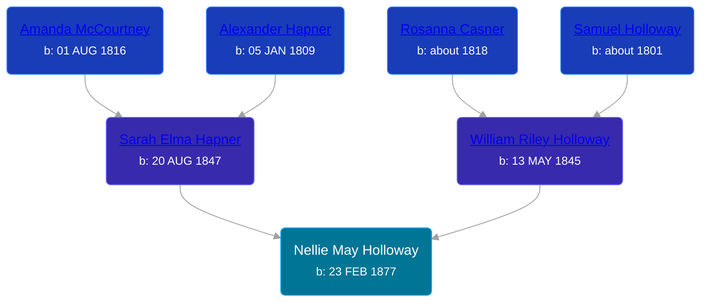

## 🟣 Nellie May Holloway
<small>Age: 98y, 8m, 15d</small>

Daughter of [William Riley Holloway](/people/9/90949012) and [Sarah Elma Hapner](/people/2/20173654)





### 📆 Events


Type | Date | Age at Event | Place
------ | ------ | ------ | ------
[Birth](#event-event-2) | 23 FEB 1877 |  | Chippewa Township, Isabella, Michigan, USA
[Death](#event-event-3) | 08 NOV 1975 | 98y, 8m, 15d | Meridian, Ingham, Michigan, USA



- **[Birth](#event-event-2)**
**Date**: 23 FEB 1877, Age:
**Place**: Chippewa Township, Isabella, Michigan, USA
- **[Death](#event-event-3)**
**Date**: 08 NOV 1975, Age: 98y, 8m, 15d
**Place**: Meridian, Ingham, Michigan, USA


### 📰 Event Sources

####  Birth, 23 FEB 1877
* Michigan, Births and Christenings Index, 1867-1911
>   
  > Name: Nellie M Holloway  
  > Gender: Female  
  > Birth Place: Chippewa, Isabella Co, Michigan  
  > Birth Date: 23 Feb 1877  
  > Baptism Place: Isabella, Michigan  
  > Father's name: William Holloway  
  > Mother's name: Sarah E  
  > FHL Film Number: 1005117

####  Death, 08 NOV 1975
* Michigan Deaths, 1971-1996
>   
  > Name: Nellie H Weston  
  > Birth Date: 23 Feb 1877  
  > Death Date: 8 Nov 1975  
  > Gender: Female  
  > Residence: Lansing, Ingham, Michigan  
  > Place of Death: Meridian, Ingham, Michigan
* U.S., Social Security Death Index, 1935-2014
>   
  > Name: Nellie Weston  
  > Last Residence: 48917 Lansing, Eaton, Michigan, USA  
  > BORN: 23 Feb 1877  
  > Died: Nov 1975  
  > State (Year) SSN issued: Michigan (1973)