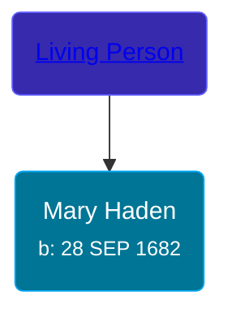

## 🟣 Mary Haden

Daughter of [Living Person](/people/6/61582599)





### 📆 Events


Type | Date | Age at Event | Place
------ | ------ | ------ | ------
Birth | 28 SEP 1682 |  | Windsor, Hartford, Connecticut, USA



- **Birth**
**Date**: 28 SEP 1682, Age:
**Place**: Windsor, Hartford, Connecticut, USA


## 👩‍❤️‍👨 Relationships

### 🔵 [Joshua Gladden](/people/9/97378440), b. 08 NOV 1681

#### Events


Type | Date | Age at Event | Place
------ | ------ | ------ | ------
Marriage | 08 OCT 1713 | 31y, 10d | Saybrook, Middlesex, Connecticut, USA



- **Marriage**
**Date**: 08 OCT 1713, Age: 31y, 10d
**Place**: Saybrook, Middlesex, Connecticut, USA


#### Children With Joshua Gladden
* 🔵 [Silas Gladding](/people/5/55129348), b. 08 MAY 1730
### 📰 Event Sources

####  Marriage, 08 OCT 1713