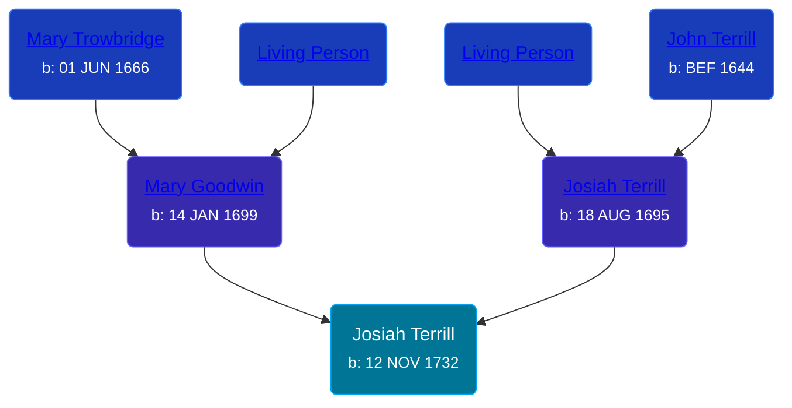

## 🔵 Josiah Terrill
<small>Age: 62y, 8m, 5d</small>

Son of [Josiah Terrill](/people/8/80183041) and [Mary Goodwin](/people/4/49404198)





### 📆 Events


Type | Date | Age at Event | Place
------ | ------ | ------ | ------
[Birth](#event-event-2) | 12 NOV 1732 |  | Milford, Connecticut, USA
[Death](#event-event-3) | 17 JUL 1795 | 62y, 8m, 5d | Waterbury, New Haven, Connecticut, USA



- **[Birth](#event-event-2)**
**Date**: 12 NOV 1732, Age:
**Place**: Milford, Connecticut, USA
- **[Death](#event-event-3)**
**Date**: 17 JUL 1795, Age: 62y, 8m, 5d
**Place**: Waterbury, New Haven, Connecticut, USA


### 📰 Event Sources

####  Birth, 12 NOV 1732
* The Town and City of Waterbury, Connecticut  - 135

####  Death, 17 JUL 1795
* Roger and Abigail (Ufford) Terrill and Some Descendants: 1632 - 1993  - 37