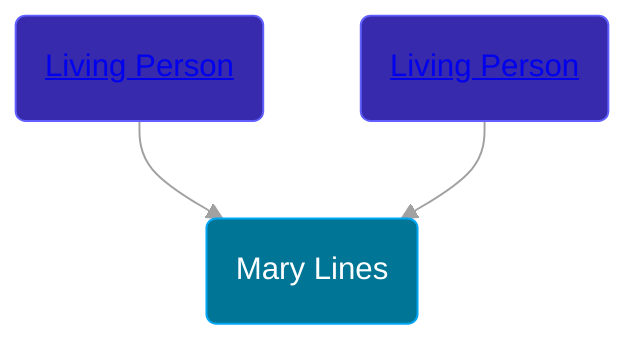

## 🟣 Mary Lines

Daughter of [Living Person](/people/8/80639382) and [Living Person](/people/3/33207612)





## 👩‍❤️‍👨 Relationships

### 🔵 [Thomas Wilmot](/people/3/36930663), b. 21 SEP 1679

#### Events


Type | Date | Age at Event | Place
------ | ------ | ------ | ------
[Marriage](#event-family-0-event-0) | 27 JUN 1705 | undefined |



- **[Marriage](#event-family-0-event-0)**
**Date**: 27 JUN 1705, Age: undefined
**Place**:


#### Children With Thomas Wilmot
* 🔵 [William Wilmot](/people/7/75329141), b. 04 MAY 1706
* 🔵 [Ezekiel Wilmot](/people/7/74243487), b. 15 FEB 1708
* 🔵 [Daniel Wilmot](/people/1/15714816), b. 26 MAY 1710
* 🔵 [Thomas Wilmot](/people/5/57007378), b. 25 AUG 1712
* 🔵 [Asa Wilmot](/people/1/15735504), b. 11 APR 1716
### 📰 Event Sources

####  Marriage, 27 JUN 1705
* Historical Catalogue of the Members of the First Church of Christ in New Haven, Connecticut  - 82
* The New England Historical and Genealogical Register  - 70
