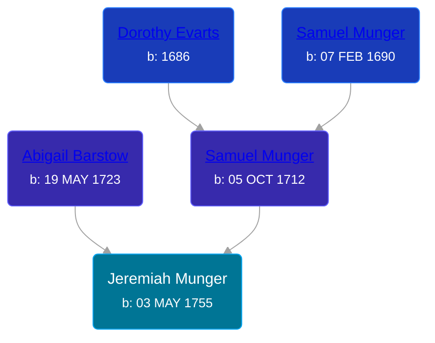

## 🔵 Jeremiah Munger

Son of [Samuel Munger](/people/1/17676382) and [Abigail Barstow](/people/9/9488484)





### 📆 Events


Type | Date | Age at Event | Place
------ | ------ | ------ | ------
[Birth](#event-event-2) | 03 MAY 1755 |  |



- **[Birth](#event-event-2)**
**Date**: 03 MAY 1755, Age:
**Place**:


### 📰 Event Sources

####  Birth, 03 MAY 1755
* The Munger Book  - 209