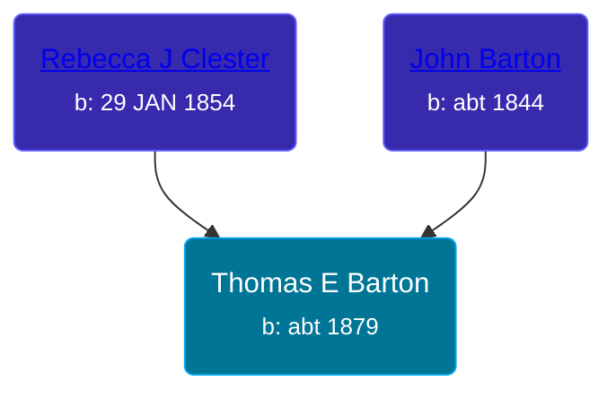

## 🔵 Thomas E Barton

Son of [John Barton](/people/5/56328061) and [Rebecca J Clester](/people/8/81769008)





### 📆 Events


Type | Date | Age at Event | Place
------ | ------ | ------ | ------
Birth | abt 1879 |  | Kansas, USA
[Residence](#event-event-0) | 10 JUN 1880 | 1y, 6m, 10d | Grant, Cloud, Kansas, USA



- **Birth**
**Date**: abt 1879, Age:
**Place**: Kansas, USA
- **[Residence](#event-event-0)**
**Date**: 10 JUN 1880, Age: 1y, 6m, 10d
**Place**: Grant, Cloud, Kansas, USA


### 📰 Event Sources

####  Residence, 10 JUN 1880
* 1880 US Census
>   
  > Name: Thomas E. Bartin  
  > Age: 1  
  > Birth Date: Abt 1879  
  > Birthplace: Kansas  
  > Home in 1880: Grant, Cloud, Kansas, USA  
  > Dwelling Number: 100  
  > Race: White  
  > Gender: Male  
  > Relation to Head of House: Son  
  > Marital Status: Single  
  > Father's Name: John W. Bartin  
  > Father's Birthplace: Pennsylvania  
  > Mother's Name: Rebeca J. Bartin  
  > Mother's Birthplace: Germany  
  >   
  > John W. Bartin, 36, Self (Head)  
  > Rebeca J. Bartin, 29, Wife  
  > James P. Bartin, 8, Son  
  > Thomas E. Bartin, 1, Son  
  >
