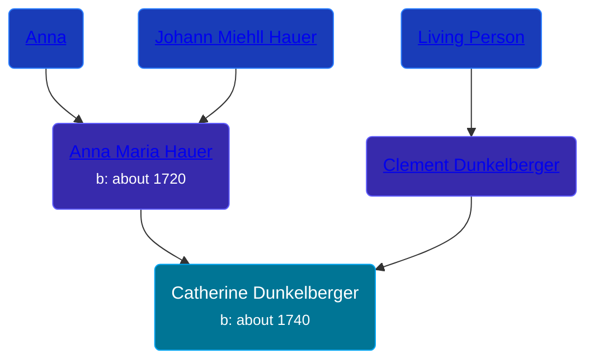

## 🟣 Catherine Dunkelberger

Daughter of [Clement Dunkelberger](/people/1/13545057) and [Anna Maria Hauer](/people/2/22963774)





### 📆 Events


Type | Date | Age at Event | Place
------ | ------ | ------ | ------
[Birth](#event-event-2) | about 1740 |  | Windsor Township, Berks, Pennsylvania, USA



- **[Birth](#event-event-2)**
**Date**: about 1740, Age:
**Place**: Windsor Township, Berks, Pennsylvania, USA


## 👩‍❤️‍👨 Relationships

### 🔵 [Living Person](/people/9/90884790)

### 📰 Event Sources

####  Birth, about 1740
* The Dunkelberger Family: Europe to America, 1600-1982