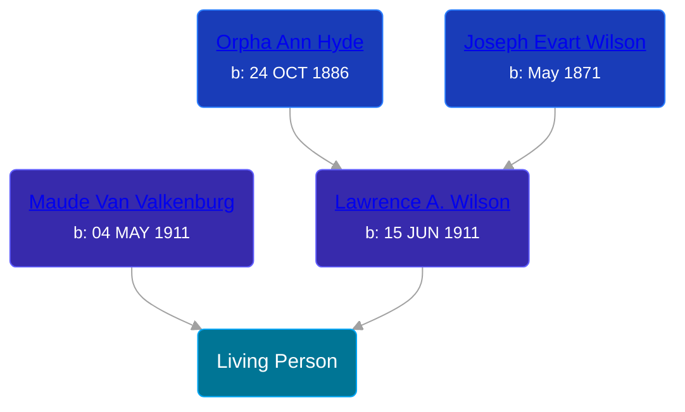

## 🟣 Living Person

Daughter of [Lawrence A. Wilson](/people/8/86477632) and [Maude Van Valkenburg](/people/4/43859609)





## 👩‍❤️‍👨 Relationships

### 🔵 [Living Person](/people/4/40788780)

#### Children With Living Person
* 🔵 [Living Person](/people/6/67661860)
* 🔵 [Living Person](/people/7/7835978)
* 🔵 [Living Person](/people/3/37402154)