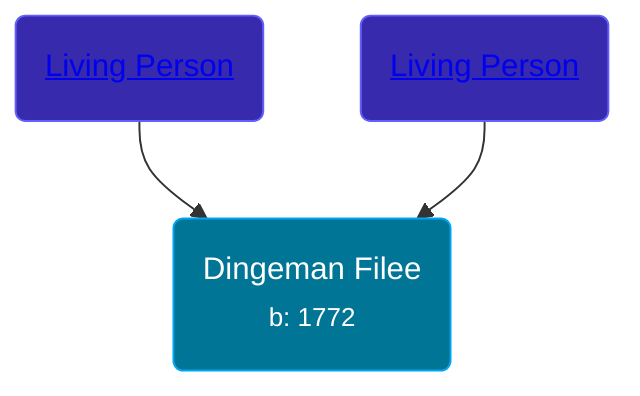

## 🔵 Dingeman Filee
<small>Age: 74y, 9m, 10d</small>

Son of [Living Person](/people/3/39514400) and [Living Person](/people/6/69144502)





### 📆 Events


Type | Date | Age at Event | Place
------ | ------ | ------ | ------
[Birth](#event-event-2) | 1772 |  | Dreischor, Zeeland, Netherlands
[Death](#event-event-3) | 10 SEP 1846 | 74y, 9m, 10d | Zonnemaire, Zeeland, Netherlands



- **[Birth](#event-event-2)**
**Date**: 1772, Age:
**Place**: Dreischor, Zeeland, Netherlands
- **[Death](#event-event-3)**
**Date**: 10 SEP 1846, Age: 74y, 9m, 10d
**Place**: Zonnemaire, Zeeland, Netherlands


## 👩‍❤️‍👨 Relationships

### 🟣 [Lamberta Vergaal](/people/9/91282624), b. 1782

#### Children With Lamberta Vergaal
* 🟣 [Jacoba Filee](/people/2/24768838), b. 1809
### 📰 Event Sources

####  Birth, 1772
* Pedigree of Lambert Leendert (Leen) Botvliet

####  Death, 10 SEP 1846
* Dutch Civil Register
>   
  > Deceased: Dingeman Filee  
  > Profession: arbeider  
  > Place of birth: Dreischor  
  > Gender: Man  
  > Marital status: Weduwnaar  
  > Age: 74 jaar  
  >   
  > Father: Johannis Filee  
  > Mother: Dina Pompoene  
  > Partner: Lamberta Vergaal  
  >   
  > Event: Overlijden  
  > Event date: 10-09-1846  
  > Event place: Bommenede  
  >   
  > Document type: BS Overlijden  
  > Heritage institution: Zeeuws Archief  
  > Institution place: Middelburg  
  > Collection region: Zeeland  
  > Archive: 25  
  > Registration number: BOM-O-1846  
  > Sourcenumber: 15  
  > Registration date: 1846  
  > Document place: Bommenede