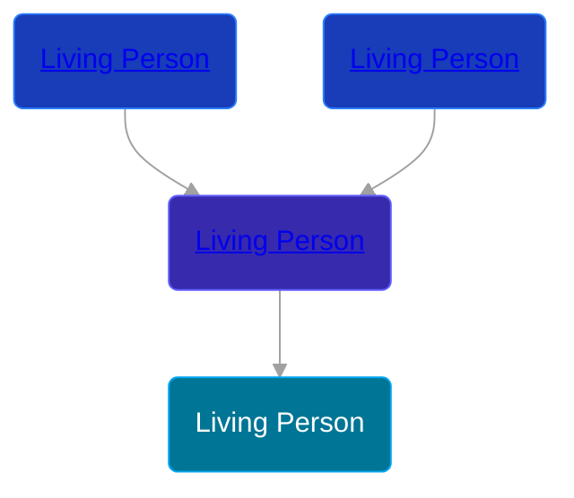

## 🔵 Living Person

Son of [Living Person](/people/8/87147493)





## 👩‍❤️‍👨 Relationships

### ⚪ Unknown Person

#### Children With Unknown Person
* 🟣 [Living Person](/people/6/64683164)
### ⚪ Unknown Person

#### Children With Unknown Person
* 🔵 [Living Person](/people/9/98903698)