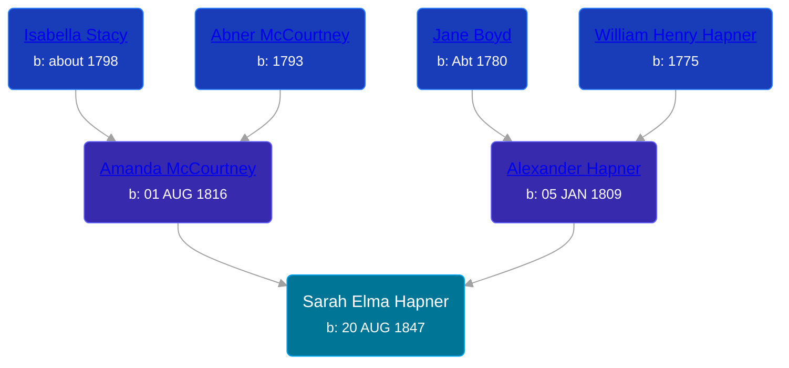

## 🟣 Sarah Elma Hapner
<small>Age: 72y, 14d</small>

Daughter of [Alexander Hapner](/people/6/68586072) and [Amanda McCourtney](/people/5/56501802)





### 📆 Events


Type | Date | Age at Event | Place
------ | ------ | ------ | ------
Birth | 20 AUG 1847 |  | Jackson, Kosciusko, Indiana, USA
[Residence](#event-event-0) | 24 SEP 1850 | 3y, 1m, 4d | Jackson, Kosciusko, Indiana, USA
[Residence](#event-event-1) | 18 OCT 1860 | 13y, 1m, 28d | Jackson, Kosciusko, Indiana, USA
[Residence](#event-event-2) | 01 JUL 1870 | 22y, 10m, 11d | Union Township, Isabella, Michigan, USA
[Residence](#event-event-3) | June 1880 | 32y, 9m, 10d | Chippewa Township, Isabella, Michigan, USA
[Residence](#event-event-4) | 11 JUN 1900 | 52y, 9m, 21d | Deerfield Township, Isabella, Michigan, USA
[Residence](#event-event-5) | 15 APR 1910 | 62y, 7m, 25d | Deerfield Township, Isabella, Michigan, USA
[Death](#event-event-10) | 04 SEP 1919 | 72y, 14d | Freemont Township, Isabella, Michigan, USA
[Burial](#event-event-11) |  |  | Riverside Cemetery, Mount Pleasant, Isabella, Michigan, USA



- **Birth**
**Date**: 20 AUG 1847, Age:
**Place**: Jackson, Kosciusko, Indiana, USA
- **[Residence](#event-event-0)**
**Date**: 24 SEP 1850, Age: 3y, 1m, 4d
**Place**: Jackson, Kosciusko, Indiana, USA
- **[Residence](#event-event-1)**
**Date**: 18 OCT 1860, Age: 13y, 1m, 28d
**Place**: Jackson, Kosciusko, Indiana, USA
- **[Residence](#event-event-2)**
**Date**: 01 JUL 1870, Age: 22y, 10m, 11d
**Place**: Union Township, Isabella, Michigan, USA
- **[Residence](#event-event-3)**
**Date**: June 1880, Age: 32y, 9m, 10d
**Place**: Chippewa Township, Isabella, Michigan, USA
- **[Residence](#event-event-4)**
**Date**: 11 JUN 1900, Age: 52y, 9m, 21d
**Place**: Deerfield Township, Isabella, Michigan, USA
- **[Residence](#event-event-5)**
**Date**: 15 APR 1910, Age: 62y, 7m, 25d
**Place**: Deerfield Township, Isabella, Michigan, USA
- **[Death](#event-event-10)**
**Date**: 04 SEP 1919, Age: 72y, 14d
**Place**: Freemont Township, Isabella, Michigan, USA
- **[Burial](#event-event-11)**
**Date**:
**Place**: Riverside Cemetery, Mount Pleasant, Isabella, Michigan, USA


## 👩‍❤️‍👨 Relationships

### 🔵 [William Riley Holloway](/people/9/90949012), b. 13 MAY 1845

#### Events


Type | Date | Age at Event | Place
------ | ------ | ------ | ------
Marriage | about 1863 | 15y, 3m, 10d |



- **Marriage**
**Date**: about 1863, Age: 15y, 3m, 10d
**Place**:


#### Children With William Riley Holloway
* 🔵 [Harry Alexander Holloway](/people/9/99774121), b. 16 MAY 1869
* 🟣 [Rose Anna Holloway](/people/2/26212000), b. 31 AUG 1871
* 🟣 [Claudia Inez Holloway](/people/1/10696840), b. 13 JUN 1873
* 🟣 [Jessie Blanche Holloway](/people/2/29242864), b. 26 APR 1875
* 🟣 [Nellie May Holloway](/people/1/18968776), b. 23 FEB 1877
* 🔵 [Fordyce W. Holloway](/people/9/91023288), b. 08 MAR 1879
* 🟣 [Emma Hapner Holloway](/people/5/58093825), b. 10 FEB 1882
* 🟣 [Bessie Grace Holloway](/people/4/42980644), b. 08 AUG 1888
* 🔵 [Earl Hazel Holloway](/people/8/86925962), b. 18 DEC 1891
### 📰 Event Sources

####  Residence, 24 SEP 1850
* 1850 US Census

####  Residence, 18 OCT 1860
* 1860 US Census

####  Residence, 01 JUL 1870
* 1870 US Census

####  Residence, June 1880
* 1880 US Census

####  Residence, 11 JUN 1900
* 1900 US Census

####  Residence, 15 APR 1910
* 1910 US Census

####  Death, 04 SEP 1919
* Michigan, Deaths and Burials Index, 1867-1995
>   
  > Name: Sadie E. Holloway  
  > [Sadie E. Hapner]   
  > Birth Date: abt 1847  
  > Birth Place: Indiana  
  > Death Date: 14 Sep 1919  
  > Death Place: Freemont Twp, Isabella, Michigan  
  > Death Age: 72  
  > Occupation: Housewife  
  > Marital Status: Married  
  > Gender: Female  
  > Residence: Isabella County, Michigan  
  > Father Name: Alick Hapnee  
  > Father Birth Place: Ohio  
  > Mother Name: Amanda McCortney  
  > Mother Birth Place: Ohio  
  > FHL Film Number: 1005119
* Isabella County Death Records  - Volume II, 1919
>   
  > Record No: 223  
  > Date of Death: 4 Sept 1919  
  > Date of Record: 4 Oct 1919  
  > Name: Sadie E. Holloway  
  > Sex: F  
  > Color: W  
  > Maritial: Married  
  > Age: 72 y, 0 m, 25 d  
  > Place of Death: Fremont Township  
  > Cause of Death: Influenza  
  > Birth Place: Indiana  
  > Occupation: Housewife  
  > Parents: Alick Hapner and Amanda McCortney

####  Burial
* findagrave.com

####  Marriage, about 1863