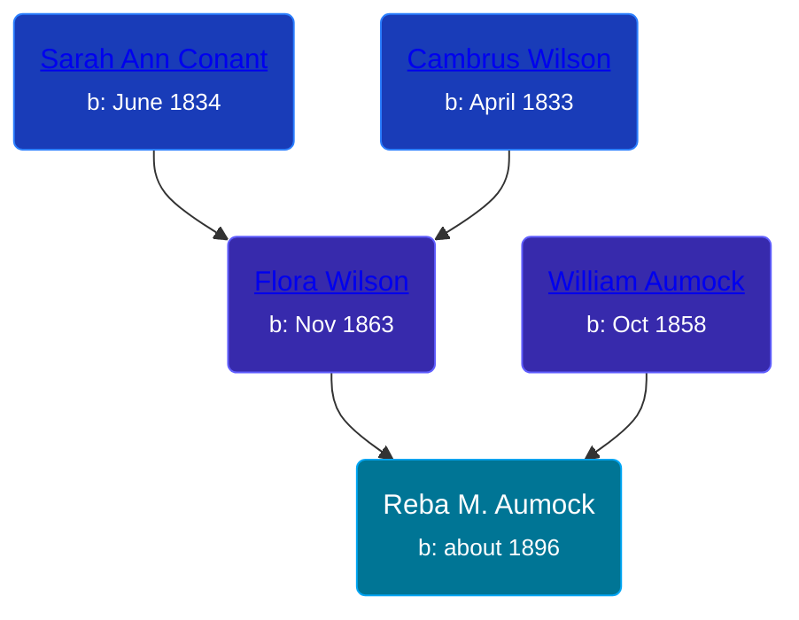

## 🟣 Reba M. Aumock

Daughter of [William Aumock](/people/5/50418111) and [Flora Wilson](/people/2/2426620)





### 📆 Events


Type | Date | Age at Event | Place
------ | ------ | ------ | ------
Birth | about 1896 |  | New York, USA
[Residence](#event-event-0) | 06 JUN 1900 | 4y, 6m, 6d | Savannah, Wayne, New York, USA
[Residence](#event-event-1) | 15 APR 1910 | 14y, 4m, 15d | Montezuma, Cayuga, New York, USA



- **Birth**
**Date**: about 1896, Age:
**Place**: New York, USA
- **[Residence](#event-event-0)**
**Date**: 06 JUN 1900, Age: 4y, 6m, 6d
**Place**: Savannah, Wayne, New York, USA
- **[Residence](#event-event-1)**
**Date**: 15 APR 1910, Age: 14y, 4m, 15d
**Place**: Montezuma, Cayuga, New York, USA


### 📰 Event Sources

####  Residence, 06 JUN 1900
* 1900 US Census

####  Residence, 15 APR 1910
* 1910 US Census
