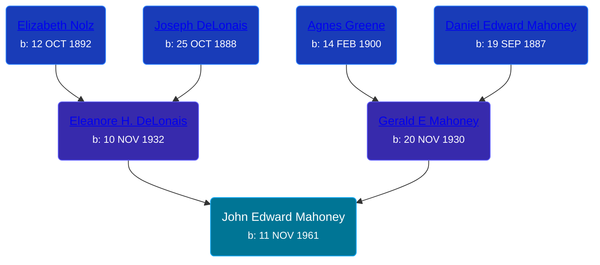

## 🔵 John Edward Mahoney
<small>Age: 61y, 4m, 9d</small>

Son of [Gerald E Mahoney](/people/1/10062624) and [Eleanore H. DeLonais](/people/4/45463626)





### 📆 Events


Type | Date | Age at Event | Place
------ | ------ | ------ | ------
Birth | 11 NOV 1961 |  |
[Death](#event-event-3) | 20 MAR 2023 | 61y, 4m, 9d |
Burial |  |  | Resurrection Cemetery, Kent, Michigan, USA



- **Birth**
**Date**: 11 NOV 1961, Age:
**Place**:
- **[Death](#event-event-3)**
**Date**: 20 MAR 2023, Age: 61y, 4m, 9d
**Place**:
- **Burial**
**Date**:
**Place**: Resurrection Cemetery, Kent, Michigan, USA


## 👩‍❤️‍👨 Relationships

### 🟣 [Living Person](/people/2/27906701)

#### Children With Living Person
* 🔵 [Living Person](/people/7/79073611)
### 🟣 [Living Person](/people/9/92555368)

#### Children With Living Person
* 🔵 [Living Person](/people/4/4287670)
### 📰 Event Sources

####  Death, 20 MAR 2023
* MKD Funeral Home
>   
  > John Edward Mahoney  
  > November 11, 1961 ~ March 20, 2023  
  >   
  > John E. Mahoney, age 61, of Wyoming, was called home by his Lord Jesus Christ on Monday, March 20, 2023. He was surrounded by his loving family. John enjoyed traveling, bowling, fishing, and trapping with his son, Eric. He also enjoyed watching both college and professional sports on television. He had a kind, giving heart and could not turn away anyone in need. He leaves behind, with broken hearts, his son, Eric and daughter-in-law, Elmira Mahoney; 3 grandchildren, Grayson, Olivia and Azlynn Mahoney; his sisters, Ann (Ben) Knapp and Mary (Chuck) Russcher; brother, David (Debbie) Mahoney; and several nieces and nephews. He was preceded in death by his parents, Gerald and Eleanore Mahoney. The family would like to give a special thanks to the wonderful staff at Faith Hospice for their compassion and excellent care. A Mass of Christian Burial will be held 11:00 a.m. on Monday at St. John Vianney Church, 4101 Clyde Park SW, Wyoming with Rev. John Vallier presiding. Burial will be held at Resurrection Cemetery. Relatives and friends may meet the family from 10-11 a.m. at the church prior to the service. Memorial contributions may be made to Faith Hospice or the American Cancer Society.
