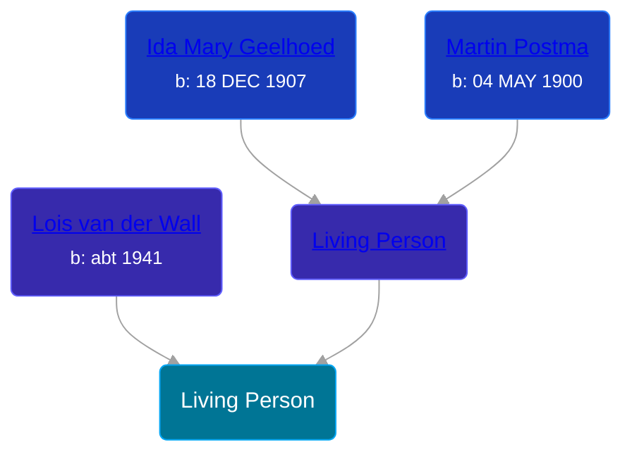

## 🔵 Living Person

Son of [Living Person](/people/5/50440830) and [Lois van der Wall](/people/8/81889469)



```mermaid
graph
classDef grands fill:#193cb8,stroke:#2b7fff,stroke-width:1px,color:#fff;
classDef parents fill:#372aac,stroke:#615fff,stroke-width:1px,color:#fff;
classDef primary fill:#007595,stroke:#00a6f4,stroke-width:1px,color:#fff;
20328096(Living Person):::primary
81889469(<a class="text-white" href="/people/8/81889469">Lois van der Wall</a><br /><small>b: abt 1941</small>):::parents-->20328096
50440830(<a class="text-white" href="/people/5/50440830">Living Person</a>):::parents-->20328096
11612484(<a class="text-white" href="/people/1/11612484">Ida Mary Geelhoed</a><br /><small>b: 18 DEC 1907</small>):::grands-->50440830
7474832(<a class="text-white" href="/people/7/7474832">Martin Postma</a><br /><small>b: 04 MAY 1900</small>):::grands-->50440830
linkStyle default stroke:#a1a1a1
```


## 👩â€â¤ï¸â€ğŸ‘¨ Relationships

### 🟣 [Living Person](/people/4/46558704)
