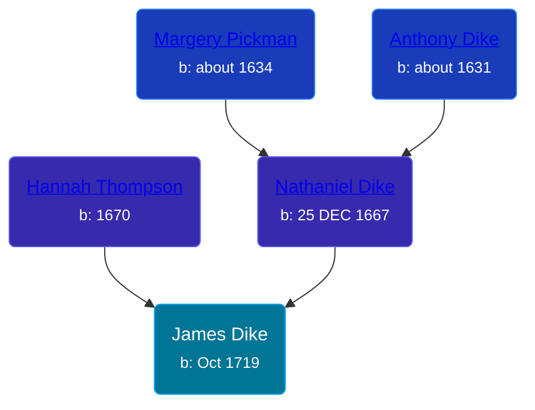

## 🔵 James Dike
<small>Age: 72y, 8m, 18d</small>

Son of [Nathaniel Dike](/people/4/44694189) and [Hannah Thompson](/people/1/1871336)





### 📆 Events


Type | Date | Age at Event | Place
------ | ------ | ------ | ------
[Birth](#event-event-2) | Oct 1719 |  | Ipswitch, Massachusetts, USA
[Death](#event-event-3) | 18 JUN 1792 | 72y, 8m, 18d | Ipswitch, Massachusetts, USA



- **[Birth](#event-event-2)**
**Date**: Oct 1719, Age:
**Place**: Ipswitch, Massachusetts, USA
- **[Death](#event-event-3)**
**Date**: 18 JUN 1792, Age: 72y, 8m, 18d
**Place**: Ipswitch, Massachusetts, USA


## 👩‍❤️‍👨 Relationships

### 🟣 [Mary Narramore](/people/3/34713515), b. 06 JUL 1716

#### Events


Type | Date | Age at Event | Place
------ | ------ | ------ | ------
[Marriage](#event-family-0-event-0) | 21 MAY 1741 | 21y, 7m, 21d | Thompson, Connecticut, USA



- **[Marriage](#event-family-0-event-0)**
**Date**: 21 MAY 1741, Age: 21y, 7m, 21d
**Place**: Thompson, Connecticut, USA


#### Children With Mary Narramore
* 🔵 [Nathaniel Dike](/people/3/36914917), b. 28 MAR 1747
### 📰 Event Sources

####  Birth, Oct 1719
* Patrick Wilson's Research

####  Marriage, 21 MAY 1741
* Patrick Wilson's Research
####  Death, 18 JUN 1792
* Patrick Wilson's Research
